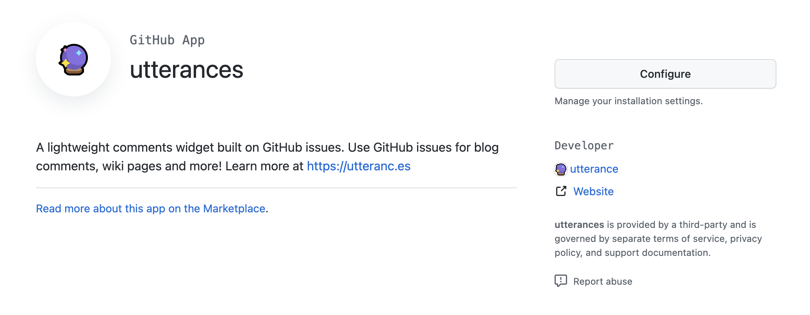
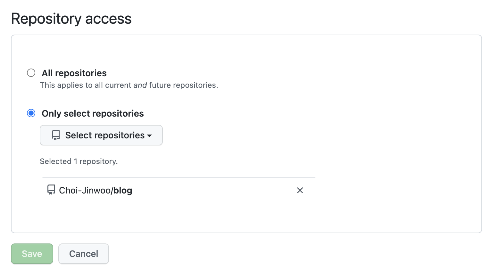
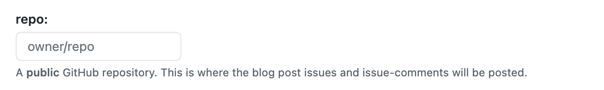
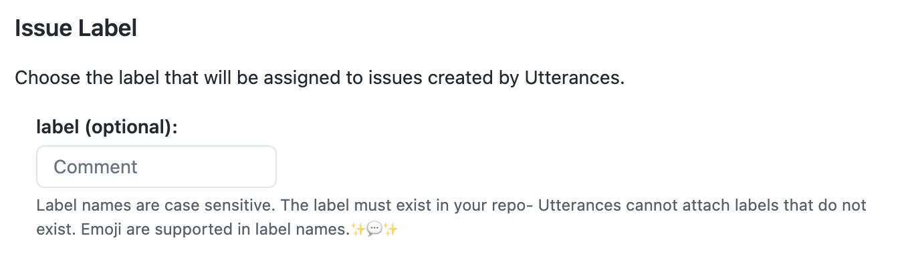
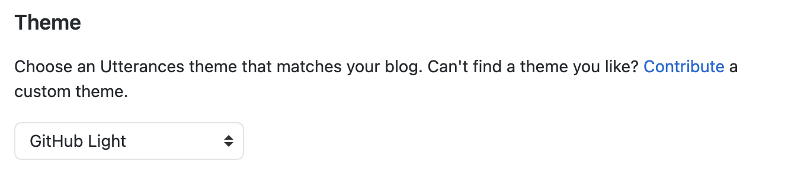
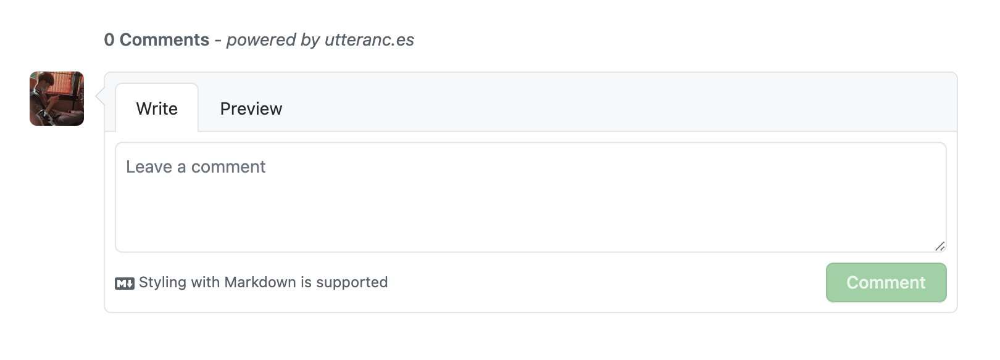

최근 블로그를 개발하며 뒷순위로 미뤘던 댓글 기능을 개발했다. 예전에 잠깐 `disqus`를 사용했는데 디자인이 복잡해 개인적으로 별로였다.

비슷한 댓글 서비스를 찾아보던 중 [Utterances](https://utteranc.es/)라는 **Github issues 기반**의 서비스를 찾았고 적용하기로 했다.

### Intro

Utterances는 페이지의 `url`, `pathname`, `title`을 통해 Github issue를 찾고 해당 issue가 없다면 utterance bot이 만들어준다.

Utterances는 이런 장점이 있다고 소개한다.

- 광고 없는 무료
- Github issue 기반
- 가벼운 바닐라 타입스크립트

[공식문서](https://utteranc.es/)에 더 많은 장점이 소개되어 있지만, 특히 저런 점들이 마음에 들었다.

### 적용해보자

문서에서 너무 친절하게 소개되어 있다.

##### 1. 원격 저장소는 public으로

issue를 등록할 원격 저장소는 `public`으로 설정한다.

public이 아닐경우 다른 사람은 댓글을 볼 수 없다.

##### 2. Utterances Github App 설치

[Utterance Github App](https://github.com/apps/utterances)에 접속해 `install` 버튼을 누른다.



설치하지 않았다면 `Configure` 버튼 대신 초록색 `install` 버튼이다.

설치 후 `public`으로 설정한 원격 저장소를 선택한다.



##### 3. (fork된 저장소의 경우) Setting 변경

**fork된 저장소의 경우만 해당**한다. `settings > issues`를 활성화해야 한다.

직접 해보지 않아 공식문서를 참고 바란다.

##### 4. 저장소 입력



공식문서의 `repo:`란에 `owner/repo`형식으로 입력한다.

##### 5. Post, Issue 매핑 방법 선택


블로그의 post와 issue를 어떻게 매핑할지 선택하는 부분이다.

- pathname: `/post/post-1`과 같은 pathname으로 매핑
- url: `https://blog.com/post/post-1`과 같은 URL로 매핑
- title: `제목`과 같은 title로 매핑
- og:title: og태그의 title로 설정
- issue number: 특정한 issue 번호로 설정
- specific term: 특정한 키워드를 통해 사용

보통 `pathname`과 `url`로 많이 설정하는 듯했고 나도 `pathname`으로 설정했다.

##### 6. issue label 설정 (선택)



utterances bot이 만드는 issue에 라벨을 설정할 수 있다.

Github에서 직접 라벨을 만들어야한다 . **입력된 라벨을 utterances가 만들어 주지 않는다.**

나는 `utterances`라는 라벨을 만들어 적용했다.

##### 7. 테마 설정



원하는 테마를 선택하면 되는데 나는 기본 github 테마를 선택했다.

##### 8. utterances 설정

```html
<script
  src="https://utteranc.es/client.js"
  repo="[ENTER REPO HERE]"
  issue-term="pathname"
  theme="github-light"
  crossorigin="anonymous"
  async
></script>
```

공식문서의 모든 폼을 입력하면 `script`가 생성된다.

댓글을 표시할 부분의 HTML에 해당 스크립트를 추가하면 된다.

##### 9. React 기반 Gatsby에 적용

React 기반의 Gatsby에 적용하기 위해선 추가적인 작업이 필요하다.

나는 `hooks`를 사용해 작업했지만, 기본적으로 아래와 같이 사용하면 된다.

```jsx
const utterancesSettings = {
  src: 'https://utteranc.es/client.js',
  repo: 'Choi-Jinwoo/blog (수정)',
  'issue-term': 'pathname (수정)',
  label: 'utterances (수정)',
  theme: 'github-light (수정)',
  crossorigin: 'anonymous',
  async: 'true',
};

const PostComment = () => {
  const ref = useRef(null);

  useEffect(() => {
    if (ref.current !== null) {
      const utterances = document.createElement('script');

      Object.entries(utterancesSettings).forEach(([key, value]) => {
        utterances.setAttribute(key, value);
      });

      ref.current.appendChild(utterances);
    }
  }, []);

  return <div ref={ref}></div>;
};
```

`PostComment` 컴포넌트에서 `ref`를 통해 script를 넣어준다.

이후 필요한 페이지에 `PostComment`컴포넌트를 추가해 사용한다.



꽤 익숙한 Github issue 기반의 댓글이 만들어지게 된다.

#### 결론

공식문서를 통해 쉽게 적용할 수 있었고 익숙하고 예쁜 위젯을 적용할 수 있어서 좋은 것 같다.

봇이 등록한 issue를 자동으로 close 해주면 편할 것 같지만, 아직 그런 기능은 찾지 못했다. 그래도 쉽고 빨리 적용한다는 게 큰 매력인 것 같다.
