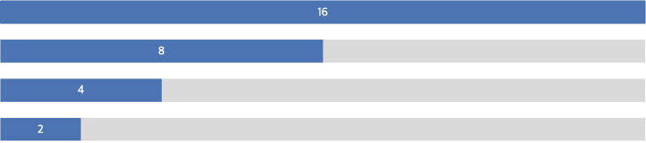
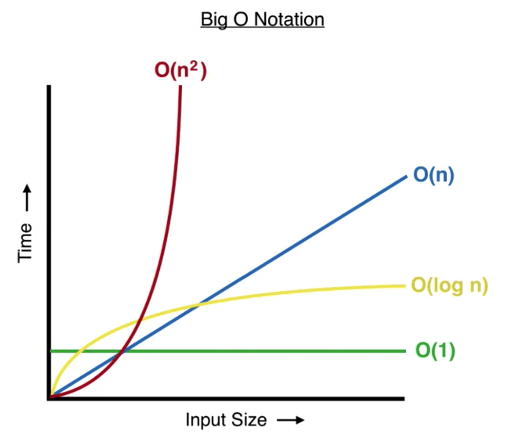

자료구조를 공부하며 Big-O 표기법을 정리해야겠다고 생각이 되어 글을 쓴다.

## 빅오(Big-O) 표기법

빅오 표기법은 알고리즘의 성능을 시간/공간 복잡도를 통해 판단한다.

빅오 표기법은 **최악의 경우**를 기준으로 표기한다.

#### 빅오 표기법의 특징

- 상수항 무시: `O(2n)`은 `O(n)`으로 표기한다.
- 영향력 없는 항 무시: `O(n + 1)`은 `O(n)`으로 표기한다.

빅오 표기법은 정확한 알고리즘의 러닝타임을 위한 표기법이 아니다.  
데이터의 증가에 따른 처리 시간의 증가율을 예측하기 위한 방법이다.

이런 이유로 위와 같은 특징을 가지게 된다.

## 빅오 표기법 종류

#### O(1)

데이터 수와 상관 없이 연산 횟수가 고정된 경우

```javascript
function example(n) {
  return n[0] * 2;
}
```

예제와 같이 데이터 `n`의 크기와 상관없이 연산은 1번 동작한다.

```javascript
function example(n) {
  return n[0] * 2 + n[1];
}
```

해당 예졔 또한 `O(1)`이다. 연산이 2번 이루어지지만 상수항은 무시하므로 `O(1)`의 시간복잡도를 가진다.

#### O(n)

데이터 수에 비례해 연산횟수가 증가하는 경우

```javascript
function example(n) {
  for (let i = 0; i < n.length; i += 1) {
    console.log(n[i]);
  }
}
```

일반적인 `for loop`와 같은 경우이다.

데이터 `n`이 증가할 경우 연산횟수는 비례해 증가한다. 데이터 `n`이 10일 경우 10회 연산된다.

#### O(n^2)

데이터에 수가 증가하면 점점 많이 증가하는 경우

```javascript
function example(n) {
  for (let i = 0; i < n.length; i += 1) {
    for (let j = 0; j < n.length; j += 1) {
      console.log(i * j);
    }
  }
}
```

이중 `for loop`와 같은 경우이다. 내부, 외부의 반복문이 모두 `n`의 크기만큼 반복된다.

반복문이 삼중 `for loop`일 경우 `O(n^3)`의 시간 복잡도를 가지게 된다.

#### O(log n)

탐색 단계마다 필요한 연산이 줄어드는 경우

`log n`에서 밑은 2이다. 결국 `데이터 수 = 2^연산횟수`가 된다. 데이터의 증가율 보다 연산의 증가율이 더 적다.

이진탐색이 대표적인 `O(log n)`의 시간 복잡도를 가지는 탐색 방법이다.



16개의 데이터는 4번의 연산으로 찾을 수 있고 1000개의 데이터는 10번의 연산으로 찾을 수 있다.

#### O(n log n)

입력 데이터가 많아지면 처리 시간이 늘어나는 경우
데이터가 많아지만 복잡도는 로그만큼 더 늘어나는 방법이다.

퀵정렬이 `O(n log n)`의 복잡도를 가진다.

### 성능 비교

`O(1) < O(log n) < O(n) < O(n log n) < O(n^2)`

100개의 데이터를 처리할때 복잡도

- `O(1)`: 1
- `O(log n)`: 7
- `O(n)`: 100
- `O(n log n)`: 700
- `O(n^2)`: 1000



자료구조를 공부하며 빅오 표기법을 정리해봤다. 조금 더 구체적인 예제가 있었으면 좋았을 것 같은데 아쉽다.

다음에 자료구조를 정리하며 예제도 함께 정리해야겠다.
