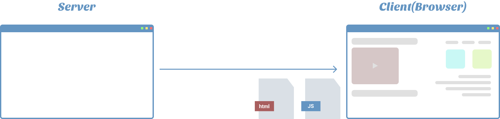

근래 `SPA`가 널리 사용되며 `CSR`이 많이 언급됐다. 또 최근엔 `SEO` 등과 같은 문제로 `SSR`이란 방식이 언급된다.

많이 이야기 되고 실제 개발하며 종종 접하기에 관련되어 SPA, CSR과 SSR에 대해 알아보려고 한다.

## SPA

`SPA(Single Page Application)`은 하나의 페이지를 가진 어플리케이션입니다. 기존 페이지 이동마다 깜빡이는 문제를 해결하기 위해 하나의 페이지로 동작하는 구조를 가진 SPA가 등장했다.

`CSR`방식으로 렌더링 되며 처음 `html, js, css` 리소스를 모두 받아오고 이후엔 서버로 `ajax`요청을 통해 데이터를 받고 화면을 업데이트한다.

하나의 페이지로 동작하여 페이지 이동 시 새로운 페이지를 서버로 요청하지 않고 `js`파일을 통해 클라이언트에서 화면을 갱신해 자연스럽게 페이지 이동이 가능하다.

**자연스러운 UX**가 장점이다.

## CSR vs SSR

### SSR(Server Side Rendering)

전통적인 렌더링 방식으로 서버로부터 완성된 `html`파일을 받아온다. 페이지의 이동이 있다면 새로운 `html`파일을 서버로 요청하고 완성된 `html`파일을 받아온다.

##### 장점

- CSR에 비해 요청할 리소스가 많지 않아 초기 로딩 속도가 빠르다
- 완성된 HTML이 응답오기 때문에 SEO(검색엔진) 최적화가 쉽다

##### 단점

- 불필요한 부분도 리렌더링됨
- 페이지 이동 시 새로고침되어 UX가 좋지 않음
- 매번 서버가 HTML을 완성해야되기에 서버에 부하가 생김

### CSR(Client Side Rendering)

초기 요청 시 `html`과 `js`파일을 함께 받아온다. 이후 `js`파일이 실행되며 **브라우저에서 화면을 그린다**

##### 장점

- 필요한 리소스만 부분적으로 로딩

##### 단점

- SEO(검색엔진) 최적화가 힘듦
- 번들된 js파일을 읽어 실행하기에 초기 로딩이 느림

## 나름의 결론

SPA가 널리 사용되며 React, Vue, Angular와 같은 CSR을 지원하는 프레임워크, 라이브러리가 많아졌다.

특정 방식이 최고라 할순 없지만 장/단점을 파악해 상황에 맞는 **최선의 선택은 할 수 있다.**

근래 `NextJS`라는 React 기반 프레임워크가 등장해 SSR 지원이 되지만 아직 경험이 없어 다음에 사용해보고 정리해야겠다.
