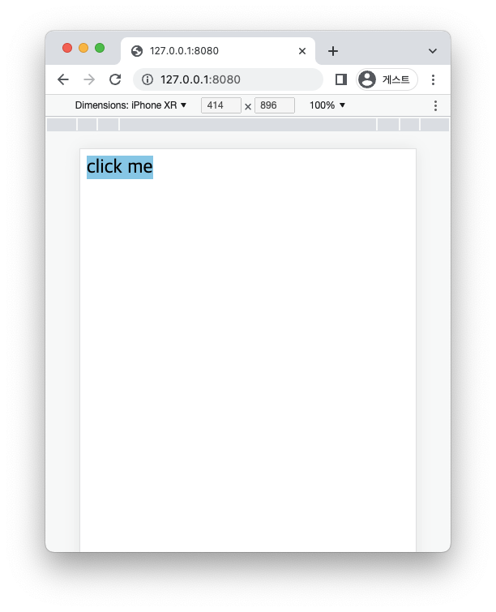

얼마전에 `@media (hover: hover)`를 알게되었는데 꽤 유용해서 정리해보려고한다.

### 기존 hover 문제점

```css
a:hover {
  background-color: skyblue;
}
```

위와 같은 스타일을 준다면 hover시 아래와 같다.


CSS를 공부한 모두가 아는 결과이다.

**하지만 모바일기기는 hover가 있을까?**

마우스를 올려놓는 행동에 대응되는 동작은 없는 것 같다. 그렇다면 위 코드는 모바일 기기에서 어떻게 동작할까?



Chrome의 모바일 모드를 통해 확인해보면 알 수 있다.

클릭 시 잠깐 hover 처리가 된다. 즉 우리가 예상하는 동작이 이루어지지 않는다.

### Media Query

이런 경우 `Media Query`를 통해 해결할 수 있다.

```css
@media (hover: hover) {
  a:hover {
    background-color: skyblue;
  }
}
```

위와 같이 준다면 디바이스 pointer로 `hover`가 가능한 경우에만 스타일을 적용한다.

실제 PC에서는 정상적으로 동작하며 모바일에선 hover에 대한 처리가 이루어지지 않는다.

반대로 아래와 같이 사용할 수 있다.

```css
@media (hover: none) {
  /* styles... */
}
```

hover가 되지 않는 디바이스에서의 스타일을 따로 줄 수 있다.

이런 미디어 쿼리를 통해서 모바일 UX를 개선할 수 있다.

hover와 함께 pointer 미디어 쿼리를 통해 디바이스 종류를 알아내는 방식도 있다.  
이번 글에서 다루는 내용은 아니라 참고문서를 통해 확인해봐도 좋을 것 같다.

### 참고 문서

- [MDN hover](https://developer.mozilla.org/en-US/docs/Web/CSS/@media/hover)
- [CSS로 PC와 Mobile 구분하는 방법 - Interaction Media Features](https://paperblock.tistory.com/164)
