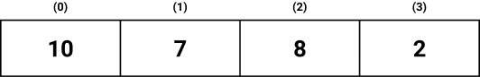
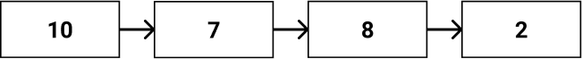
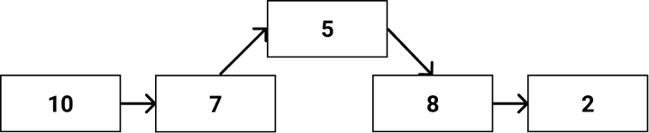
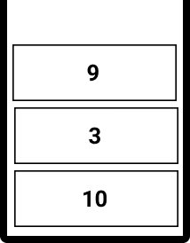
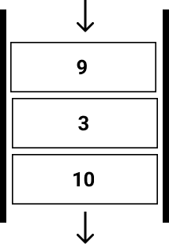
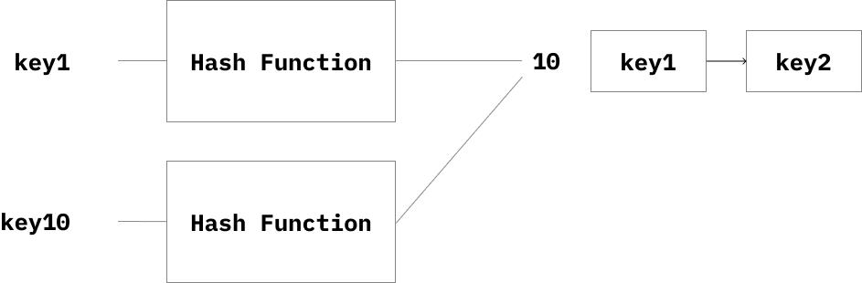
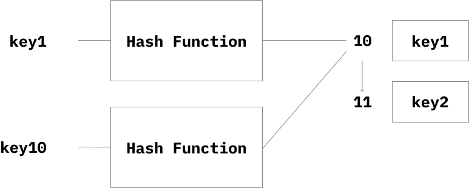

이번 글에선 [자바스크립트 자료구조 저장소](https://github.com/Choi-Jinwoo/js-data-structure)에서 구현해본 자료구조들을 정리한다.

빅오 표기법이 헷갈린다면 [빅오 표기법 관련 글](https://choi-jinwoo.github.io/post/development/big-o-notation/)을 참고하면 좋을 것 같다.

### ArrayList

`index`를 통해 데이터에 접근하는 방식이다.



ArrayList는 `index`를 통해 접근하기에 조회 시 `O(1)` 시간 복잡도를 가진다.

추가, 삭제 시 ArrayList의 요소들을 밀거나 당겨주는 연산이 필요하므로 `O(n)`의 시간 복잡도를 가진다.

[ArrayList 자바스크립트 구현](https://github.com/Choi-Jinwoo/js-data-structure/blob/main/ArrayList/index.js)

### LinkedList

`node`들이 연결되어 리스트를 이루는 형태이다.



LinkedList는 가장 첫 노드 `head` 부터 순차적으로 조회할 데이터까지 접근해 조회 시 `O(n)`의 시간 복잡도를 가진다.



반면 단순 삽입, 삭제 시 노드의 연결만 수정하기에 `O(1)`의 시간 복잡도를 가진다.  
하지만 삽입, 삭제할 데이터를 탐색해 삽입, 삭제가 이루어진다면 `O(n)`의 시간 복잡도를 가진다.

[LinkedList 자바스크립트 구현](https://github.com/Choi-Jinwoo/js-data-structure/blob/main/LinkedList/index.js)

### Stack

`LIFO(Last In First Out)`의 특징을 가진 자료구조이다. `LIFO`는 나중에 들어온 값이 먼저 나가게 되는 특징이다.



`push`, `pop` 연산을 가진다.

`push`는 스택의 끝에 새로운 값을 추가하는 연산으로 `O(1)`의 시간 복잡도를 가진다.

`pop`은 스택의 끝의 값을 제거하고 반환하는 연산이다. 마찬가지로 `O(1)`의 시간 복잡도를 가진다.

[Stack 자바스크립트 구현](https://github.com/Choi-Jinwoo/js-data-structure/blob/main/Stack/index.js)

---

(응용)

[Stack 2개로 Queue 구현](https://github.com/Choi-Jinwoo/js-data-structure/blob/main/Stack/challenge/first.js)  
[Stack으로 괄호 유효성 검사](https://github.com/Choi-Jinwoo/js-data-structure/blob/main/Stack/challenge/second.js)

### Queue

`FIFO(First In First Out)`의 특징을 가진 자료구조이다. Stack과 달리 먼저 들어온 값이 먼저 나가는 공정한 자료구조다.



가장 첫 원소를 `front`, 가장 끝 원소를 `rear`로 가르키며 삭제, 삽입 연산인 `enqueue`와 `dequeue`를 수행한다.

`enqueue`는 큐의 끝에 새로운 값을 추가하는 연산으로 `O(1)`의 시간 복잡도를 가진다.

`dequeue`는 큐의 앞의 값을 제거하고 반환하는 연산이다. `O(1)`의 시간 복잡도를 가진다.

[Queue 자바스크립트 구현](https://github.com/Choi-Jinwoo/js-data-structure/blob/main/Queue/index.js)

### Binary Search Tree

이진 탐색 트리는 빠른 탐색을 위한 자료구조이다.

기본적인 이진 트리의 특징은 모두 가지며 왼쪽 자식은 본인보다 작고 오른쪽 자식은 본인보다 크다.

```
이진 탐색 트리

     10
    /  \
   4   14
  / \
 2   6
```

이진 탐색 트리는 아래와 같은 조건을 가진다.

- 모든 노드의 키는 유일
- 왼쪽 서브 트리의 키들은 루트의 키보다 작음
- 오른쪽 서브 트리의 키들은 루트의 키보다 큼
- 왼쪽, 오른쪽 서브 트리도 이진 탐색 트리

평균 이진 탐색 트리의 탐색은 `O(log n)`의 시간 복잡도를 가진다.

단, 편향 트리의 최악의 경우 `O(n)`의 복잡도를 가지게 된다.

> 이진 트리의 높이인 O(h)의 시간 복잡도를 가진다. 평균 이진 트리의 높이는 `log n` 이다.

[Binary Search Tree 자바스크립트 구현](https://github.com/Choi-Jinwoo/js-data-structure/blob/main/BST/index.js)

### Heap

Heap은 우선순위 큐를 구현하기 위한 자료구조이다.

> **우선순위 큐**
>
> 각 원소가 우선순위를 가지며 우선순위가 높은 데이터 부터 처리하는 자료구조이다.

힙은 `완전 이진 트리`의 일종이며 느슨한 정렬 상태를 유지한다.

부모노드는 항상 자식 노드보다 큰 값을 가진다.

우선순위가 높은 원소를 찾는 시간 복잡도는 `O(1)`이다.

(최대힙 기준)

삽입 시 트리의 끝에 요소가 추가되며 자신의 부모보다 클경우 재귀적으로 부모와 `swap`한다. `O(log n)`의 시간 복잡도를 가진다.

삭제 연산은 트리의 `root`노드를 제거한 후 마지막 노드를 `root`노드로 사용한 후 `heap`의 성질을 가지도록 정렬한다. `O(log n)`의 시간 복잡도를 가진다.

[Heap 자바스크립트 구현](https://github.com/Choi-Jinwoo/js-data-structure/blob/main/Heap/index.js)

---

응용

[Heapify 구현](https://github.com/Choi-Jinwoo/js-data-structure/blob/main/Heap/challenge/first.js)

### Hash

Hash 자료구조는 `key`, `value`를 저장하는 데이터 구조이다.

`Hash Function`을 통해 `key`를 통해 `index`를 만들어 접근하는 자료구조이다.

다른 두 `key`가 `Hash Function`을 통해 하나의 `index`를 가지게 된다면 `해시 충돌`이 발생한다.

해시 충돌을 처리하는 방식은 아래와 같다.

##### Separate Chaining

LinkedList와 같은 추가 자료구조를 사용하는 방법이다.



##### Open Addressing

해시 배열의 빈 공간을 사용하는 방법으로 해시 충돌 시 `index`부터 순차적으로 빈 곳을 탐색해 빈 공간에 값을 저장한다.



`index`인 `key`를 통해 바로 접근할 수 있어 조회, 삽입, 삭제 시 `O(1)`의 시간 복잡도를 가진다.

하지만 `해시 충돌`이 잦을 수록 더 느려지며 모든 `key`에 대해 해시 충돌이 발생할 경우 삽입, 삭제, 탐색이 `O(n)`의 시간 복잡도를 가진다.

[Hash 자바스크립트 구현](https://github.com/Choi-Jinwoo/js-data-structure/blob/main/Hash/index.js)

---

이번 글에선 여러 자료구조들의 특징과 시간 복잡도를 위주로 짧게 정리해봤다.

자바스크립트를 통해 구현한 예제를 함께 확인하면 이해에 더 도움이 될 것 같다.
