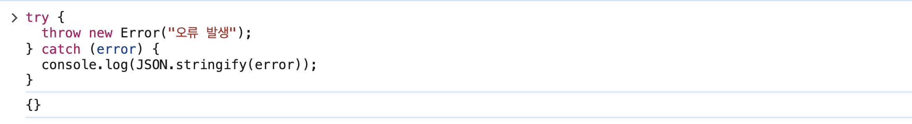
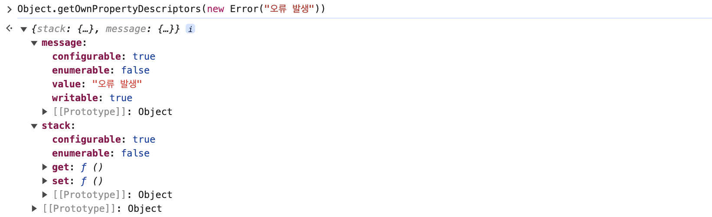

자바스크립트에서 오류 리포트를 위해서 error 객체를 serialize 하는 경우가 있다.

그렇다면 에러 객체를 어떻게 serialize 할 수 있을까?  
가장 쉽게 떠오르는 방법은 `JSON.stringify()`로 에러 객체를 JSON 문자열로 바꾸는 방법일 것 같다.

```javascript
try {
  throw new Error('오류 발생');
} catch (error) {
  console.log(JSON.stringify(error));
}
```

너무 간단하지만 이 방법은 실제로 기대와 같이 동작하지 않는다.

코드를 실행해보면 `{}` 빈 객체가 콘솔에 찍히게 된다.



왜 빈 객체가 반환될까? 그리고 어떻게 해야 의도대로 할 수 있을까?

# JSON.stringify 에서 왜 빈 객체가 반환될까?

[MDN의 JSON.stringify 문서](https://developer.mozilla.org/ko/docs/Web/JavaScript/Reference/Global_Objects/JSON/stringify#%EC%84%A4%EB%AA%85)를 보면 `열거 불가능한 속성들은 무시된다.` 라는 내용이 있다.

열거 불가능 속성은 실제로 무시되는지 한번 확인해보자.

```js
const obj = Object.create(null, {
  name: {
    value: 'Steve',
    enumerable: true,
  },
  age: {
    value: 20,
    enumerable: false,
  },
});

console.log(obj); // {name: 'Steve', age: 20}
console.log(JSON.stringify(obj)); // {"name":"Steve"}
```

`Object.create`를 통해 name, age 속성을 가진 객체를 만드는데 이때 age 속성은 `enumerable`을 false로 정의했다.

그리고 `console.log` 와 `JSON.stringify`를 해보면 `JSON.stringify`의 반환값에서 `age` 속성이 보이지 않는다.

## 에러 객체는?

그렇다면 `Error` 객체는 어떨까?

`Object.getOwnPropertyDescriptors` 메서드로 객체의 속성 정보를 확인할 수 있다.



message, stack 속성 모두 `enumerable`이 false 이다. 즉, **열거 불가능한 속성**이다.

Error 객체의 속성들이 열거 불가능한 속성이라 JSON.stringify 했을때 빈 객체가 나온다는 사실을 알 수 있었다.

## 어떻게 해결할 수 있을까?

[JSON.stringify의 두번째 인자 replacer](https://developer.mozilla.org/ko/docs/Web/JavaScript/Reference/Global_Objects/JSON/stringify#replacer_%EB%A7%A4%EA%B0%9C_%EB%B3%80%EC%88%98) 를 통해 해결할 수 있다.

replacer 인자는 함수 혹은 배열 값이 들어갈 수 있는데, 배열인 경우 JSON 문자열로 변환할 속성 이름 배열이 된다.

```javascript
JSON.stringify({
  name: 'Steve',
  age: 20,
});
// {"name":"Steve","age":20}

JSON.stringify(
  {
    name: 'Steve',
    age: 20,
  },
  ['age']
);
// {"name":"Steve"}
```

이렇게 동작하는데 열거 불가능한(non-enumerable) 속성도 replacer 배열에 포함되면 JSON으로 변환된다.

```javascript
const obj = Object.create(null, {
  name: {
    value: 'Steve',
    enumerable: true,
  },
  age: {
    value: 20,
    enumerable: false,
  },
});

console.log(JSON.stringify(obj, ['name', 'age'])); // {"name":"Steve","age":20}
```

아까와 동일한 예시에서 replacer 만 추가해보면 `age` 필드까지 JSON으로 잘 변환되는걸 확인할 수 있다.

그럼 이제 error 객체에 동일하게 적용해보면

```javascript
const error = new Error('오류 발생!');

JSON.stringify(error, Object.getOwnPropertyNames(error));
// '{"stack":"Error: 오류 발생!\\n    at <anonymous>:1:15","message":"오류 발생!"}'
```

이렇게 stack, message 필드까지 JSON 문자열로 변환되는걸 확인할 수 있다.  
(Object.getOwnPropertyNames 메서드로 객체의 속성 이름 배열을 가져올 수 있다)

## Reference

- [MDN JSON.stringify](https://developer.mozilla.org/ko/docs/Web/JavaScript/Reference/Global_Objects/JSON/stringify)
