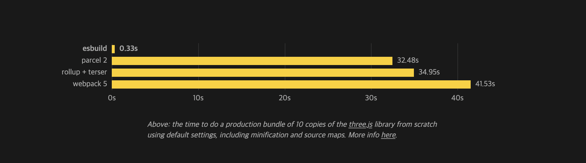
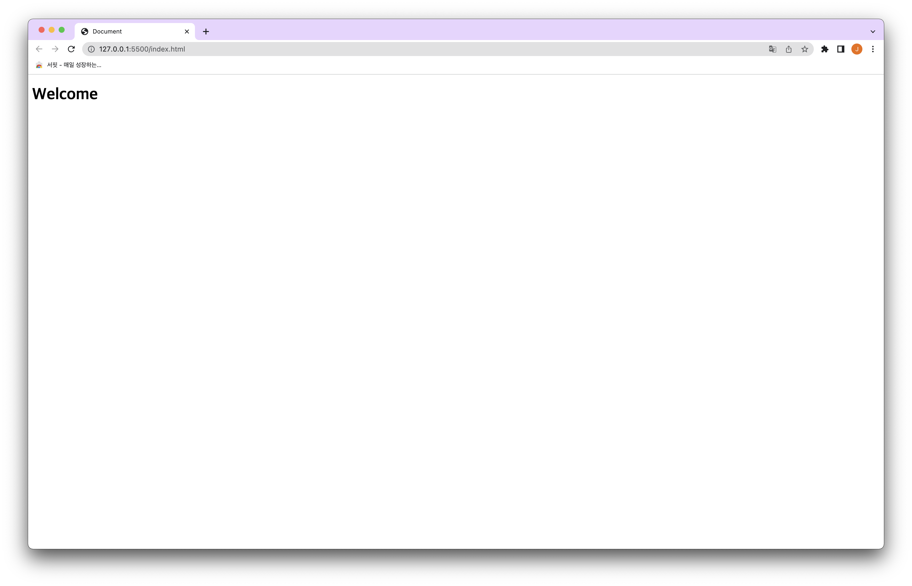

자바스크립트에서 모듈이 등장하고 이런 모듈을 번들링하기 위한 번들러가 등장했다.

현재까지도 가장 많이 사용하는 `webpack`이 대표적인 번들러다.

회사에서도 `webpack`을 통해 번들링하고 있는데 프로젝트가 커서 빌드가 꽤 오래 걸린다.

그래서 알아보던 중 빠른 새로운 번들러를 알게됐고 그게 `esbuild`다.

### esbuild

`esbuild`에서 제공하는 다른 번들러와의 속도 차이이다. 꽤 많은 차이가 난다.



`esbuild`가 이렇게 빠를 수 있는 이유를 `esbuild`에서는 아래와 같이 설명한다. (자세한 내용은 [공식문서](https://esbuild.github.io/faq/#why-is-esbuild-fast) 참고)

- `Go`로 작성됨
- 병렬 처리
- 효율적인 메모리 사용
- esbuild는 처음부터 모두 직접 개발함

esbuild는 컨텐츠 타입에 맞는 loader를 가지며 loader를 통해 파일을 `esbuild`가 읽을 수 있게 한다.

기본으로 내장된 loader가 있고 `js, jsx, ts, tsx` loader가 지원된다.

기본으로 내장된 컨텐츠 타입과 loader은 [공식문서](https://esbuild.github.io/content-types/)에 정리되어있다.

### esbuild + react

`esbuild`로 `react`를 실행하며 사용법을 간단히 익혀보자

> React 18 기준으로 작성되어 `ReactDOM.render`가 사용되지 않는다.

`esbuild`와 `react`관련된 패캐지를 설치한다.

```shell
$ mkdir {project}
$ cd {project}

$ yarn init
$ yarn add -D esbuild
$ yarn add react react-dom
```

이후 `index.jsx, App.jsx, util.js` 파일을 작성했다.

```jsx
// src/index.jsx
import React from 'react';
import ReactDOM from 'react-dom/client';
import App from './App';

const root = ReactDOM.createRoot(document.querySelector('#root'));
root.render(<App />);

// src/App.jsx
import React from 'react';
import { getRandomWelcomeText } from './utils';

function App() {
  return (
    <div>
      <h1>{getRandomWelcomeText()}</h1>
    </div>
  );
}

export default App;

// src/utils.js
export function getRandomWelcomeText() {
  const welcomeTexts = ['Hello World', 'Welcome', 'Hi esbuild'];

  return welcomeTexts[Math.ceil(Math.random() * 10) % welcomeTexts.length];
}
```

그리고 `yarn build` 명령어를 추가하자

```json
// package.json
...
"scripts": {
  "build": "esbuild src/index.jsx --outdir=dist --bundle"
}
...
```

`outdir`은 번들링 된 파일을 위치할 폴더이고 `--bundle` 옵션을 통해서 `import`된 파일을 모두 하나의 파일로 번들링한다.

마지막으로 `html` 파일을 만들어주면 된다.

```html
<!-- index.html -->
<!DOCTYPE html>
<html lang="en">
  <head>
    <meta charset="UTF-8" />
    <meta http-equiv="X-UA-Compatible" content="IE=edge" />
    <meta name="viewport" content="width=device-width, initial-scale=1.0" />
    <title>Document</title>
  </head>
  <script src="./dist/index.js" defer async></script>
  <body>
    <div id="root"></div>
  </body>
</html>
```

빌드 후 `index.html` 파일 브라우저에서 확인해보면 잘 동작하는걸 확인할 수 있다.

```shell
$ yarn build
```



간단히 `esbuild + react`로 앱을 실행해봤다.

아직 일반 번들러와 직접 비교해보지 못했지만 확실히 빠르다는 느낌이 있었다.

다음엔 `esbuild`를 통해서 빌드속도를 개선해보는 작업을 하고 싶다.
