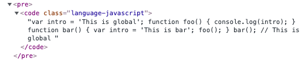
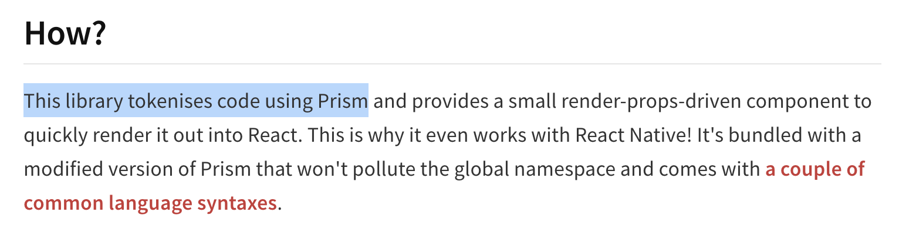
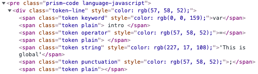

Gatsby의 블로그를 운영하며 `syntax highlighting`이 필요하다고 느꼈다. 이전 글에서 자바스크립트 코드를 작성했는데 너무 눈에 들어오지 않았기 때문이다.

글에 앞서 내가 사용한 기술은 `gatsby-plugin-mdx`를 통해 `mdx`를 변환했다.

### 왜 나만 적용이 안될까

[gatsby-remark-prismjs](https://www.gatsbyjs.com/plugins/gatsby-remark-prismjs/)를 처음 적용해봤다. `gatsby syntax highlighting`라고 검색했을때 상단에 노출되는 플러그인이다.

공식문서를 따라 적용해봤지만 난 이상하게 적용이 안됐다. 확인해보니 하이라이팅할 코드가 토큰화 되어 있지 않았다.



이렇게 `code`태그 내부에 텍스트로 존재했다. `gatsby-remark-prismjs`의 문서에 토큰화에 관련된 부분이 없어 일단 다른 방법을 찾았다.

### prism react renderer

이전과 비슷히 [prismjs](https://prismjs.com/)기반의 라이브러리였다.



공식문서에는 `Prism`을 통해 토큰화를 한다고 표시되어 있어 해당 라이브러리를 사용하기로 했다.

[공식문서](https://www.npmjs.com/package/prism-react-renderer)와 다른 블로그를 보며 따라해봤다.

```
$ npm install prism-react-renderer
// or
$ yarn add prism-react-renderer
```

#### CodeBlock 컴포넌트

```jsx
import React from 'react';
import Highlight, { defaultProps } from 'prism-react-renderer';
import theme from 'prism-react-renderer/themes/github'; // 테마는 github 외에도 많다

const CodeBlock = ({ children }) => {
  // 언어를 찾기위한 과정
  const className = children.props.className || '';
  const matches = className.match(/language-(?<lang>.*)/);
  const language = matches?.groups?.lang ?? '';

  return (
    <Highlight
      {...defaultProps}
      code={children.props.children.trim()}
      language={language}
      theme={theme}
    >
      {({ className, tokens, getLineProps, getTokenProps }) => (
        <pre className={className}>
          {tokens.map((line, i) => (
            <div {...getLineProps({ line, key: i })}>
              {line.map((token, key) => (
                <span {...getTokenProps({ token, key })} />
              ))}
            </div>
          ))}
        </pre>
      )}
    </Highlight>
  );
};

export default CodeBlock;
```

코드에서 볼 수 있듯 토큰화 하는 부분이 존재한다. `pre`태그 내부의 `TextNode`를 `div`와 `span`으로 토큰화를 시켜준다.

공식문서와 비슷하지만 다른 부분이 2가지 정도 있다.

##### code

`Highlight`컴포넌트의 props로 `code`를 넘긴다. 이때 우리가 넘겨줘야할 부분은 `pre > code`의 텍스트 값이다.

```html
<pre>
  <code>
    // 실제 적용될 코드
  </code>
</pre>
```

`children.props.children`은 실제 코드 부분 즉 `code` 내부의 텍스트 노드를 가져오기 위함이다.

##### language

보통 마크다운에서 언어를 표시하게 되면 `language-javascript`와 같이 `language-`라는 prefix가 붙게 된다.

예시의 `javascript`처럼 언어 부분을 파싱하기 위한 과정이 추가됐다.

##### style

```jsx
{
  ({ className, style, tokens, getLineProps, getTokenProps }) => (
    <pre className={className} style={style}>
      // ...
    </pre>
  );
}
```

공식문서에서 `style`을 `pre`태그의 props로 내려주는데 이 부분을 제외했다.

`style`을 내려주면 `pre`태그의 `background color`가 변하는데 직접 설정한 색상을 적용하고 싶었다.

#### MDX 적용

기존의 `pre`태그를 `CodeBlock` 컴포넌트로 대체한다. `MDXProvider`를 사용한다.

```jsx
<MDXProvider
  components={{
    pre: CodeBlock,
  }}
>
  <MDXRenderer>{body}</MDXRenderer>
</MDXProvider>
```

기존 `MDXRenderer`컴포넌트를 `MDXProvider`로 감싸고 `components` props를 넘겨준다.



라이브러리가 적용 되어 토큰화 되고 github 테마로 하이라이팅도 된다.

`gatsby syntax highlighting`에 관련해 한글로 잘 정리된 블로그가 없어 직접 정리해봤다. 적용에 목적을 두어 `prism-react-renderer`라이브러리의 원리나 정확한 동작을 파악하진 못했다.

##### References

- [Adding Syntax Highlighting to Gatsby MDX with Prism](https://codetrain.io/adding-prism-syntax-highlighting-to-gatsby-mdx)
