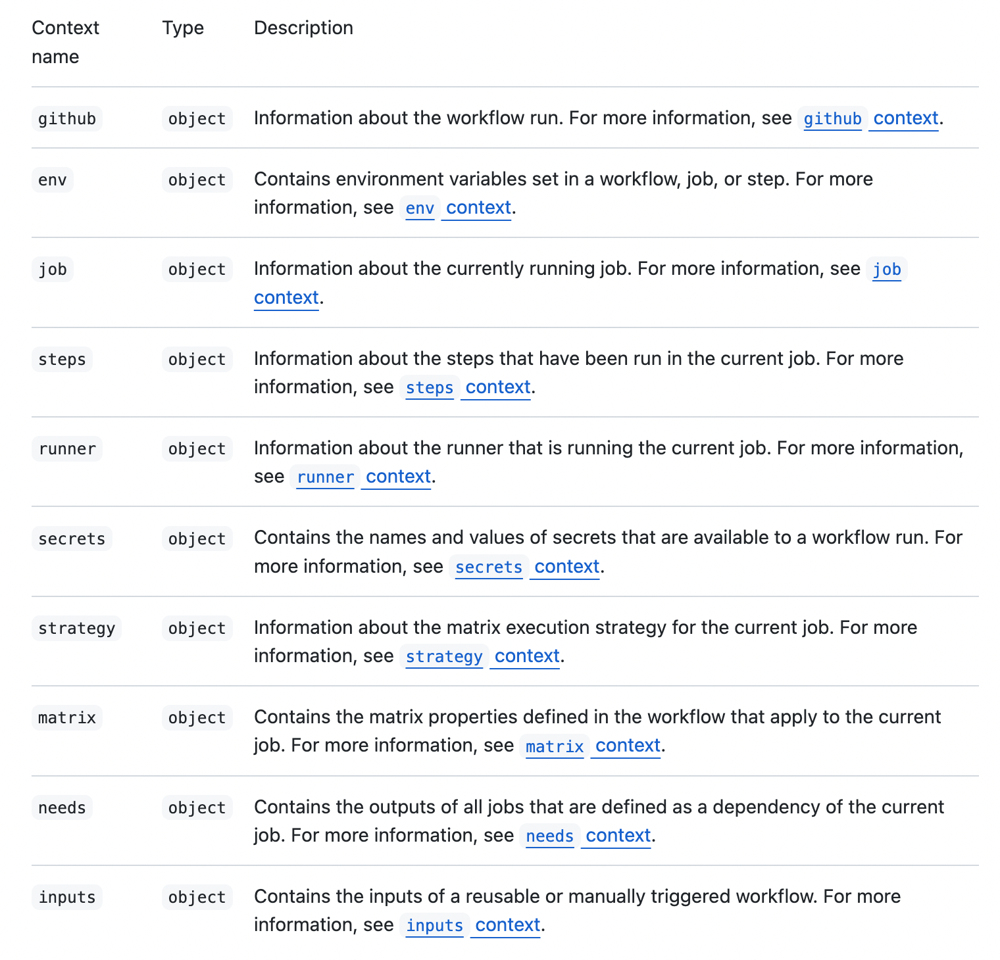

Github Actions에서 Pull Request 시 branch 이름을 사용하는 상황이 있었다.

branch가 `dev, stg, prod`일 경우를 분기했어야했다.

이때 Pull Request의 base branch와 source branch를 사용하는 방법이다.

### Contexts

github actions의 문서 중 [contexts](https://docs.github.com/en/actions/learn-github-actions/contexts)라는 내용이 있다.

contexts는 workflows run이나 runner environments 등의 정보에 접근할 수 있는 방법이며 각 context는 `object` 형태로 되어있다고 한다.



이런 contexts는 `${{ something }}`과 같이 표현해 사용할 수 있다.

### Branch

branch 정보는 `github context`에 있다.

base branch는 `github.base_ref`이며 source branch는 `github.head_ref`이다.

두 branch 정보는 모두 `pull request`일 경우 값을 사용할 수 있다.

실제로 사용은 아래와 같이 할 수 있다.

```yml
name: Branch name

on:
  pull_request:
    branches: ['main']

jobs:
  build:
    runs-on: ubuntu-latest

    steps:
      - name: branch
        run: |
          echo ${{ github.head_ref }}
          echo ${{ github.base_ref }}
```

위와 같이 사용할 수 있으며 실제 PR을 올린다면 아래와 같은 결과를 확인할 수 있다.


글에서는 branch 이름만을 다뤘으나 공식문서에 더 많은 properties를 확인할 수 있으니 확인해보면 좋을 것 같다.

### 참고

[Github Actions 공식문서 (Contexts)](https://docs.github.com/en/actions/learn-github-actions/contexts)
