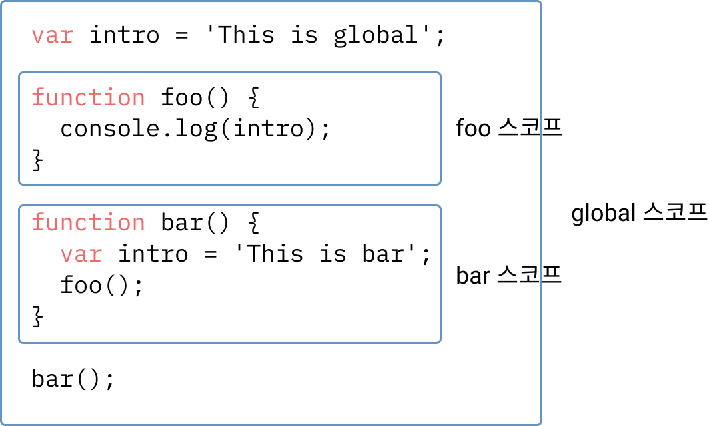

이번 글은 예전 tistory에 [작성한 글](https://wlswoo.tistory.com/49?category=861943)을 보충, 수정하며 작성한다.
내용 자체는 대부분 새로 쓰지만 예전 글도 상기시켜보고 싶었다.

클로저를 소개하는 많은 글과 문서들은 모두 다르게 설명하며 이런 부분이 더 혼란스럽게 한다. 하지만 사실 생각보다 간단하며 클로저를 몰라도 모두 사용해봤다.

클로저를 알기위해선 `Lexical Scoping`을 알아야한다.

### Lexical Scoping

`Lexical Scoping`이란 정적 스코프 방식이다. 자신의 상위 스코프를 정하는 방식 중 하나로 **선언된 시점에 자신의 상위스코프**를 정해 **정적**이다. 자바스크립트에선 `Lexical Scoping`을 사용하고 있다.

```javascript
var intro = 'This is global';

function foo() {
  console.log(intro);
}

function bar() {
  var intro = 'This is bar';
  foo();
}

bar();

// This is global
```

위 예시에서 출력된 값은 `This is global`이다. 당연해보이지만 헷갈릴 수 있다. 하나씩 보며 왜 `This is global`이 출력됐는지 알아보자.

이미 선언된 시점에 각 함수들은 자신의 상위 스코프를 가진다.



스코프는 `global`, `foo`, `bar` 스코프가 생기며 바로 바깥 박스가 상위 스코프로 결정된다.
그렇다면 `function foo`의 상위 스코프는 뭘까? **global 스코프가 상위 스코프**이다.

이런 방식이 `Lexical Scoping`이고 여기서 `스코프 체이닝`을 생각해보면 이전 예제의 답을 찾을 수 있다.

`foo`에서 `console.log(intro)`가 실행되며 `intro`를 찾기위해 상위스코프를 순서대로 탐색한다. 이때 상위 스코프는 `global`이고 정의된 `var intro = 'This is global` 변수가 사용된다.

### 클로저

그렇다면 클로저와 `Lexical Scoping`는 무슨 관계이며 언제 썼을까?

많이들 클로저를 **내부 함수에서 외부 함수의 맥락에 접근할 수 있는 것**과 같이 설명한다. 예제 코드를 통해 쉽게 생각해보자.

```javascript
function outer() {
  var intro = 'hello world';

  function inner() {
    console.log(intro);
  }

  inner();
}

outer();
```

`outer`함수에서 `intro`, `inner`를 정의했고 `inner`를 호출했다. `inner`가 호출되며 내부 함수(inner)에서 외부 함수(outer)의 자원인 `intro`에 접근했다.

아까 정의한 클로저의 의미로 이해한다면 클로저라고 할 수 있지만 사람마다 조직마다 내린 정의가 달라 클로저가 아니라고 생각할 수 있다. 하지만 그건 중요하지 않다. **클로저의 핵심이 아니기 때문이다.**

오히려 혼란스럽게 느껴지는 예시를 든 이유는 클로저의 핵심이 아닌 위 예제와 같은 애매한 경우로 클로저 이해에 방해가 되지 않기 위해서이다.

애매한 부분은 클로저에 대한 정의에 따라 다르며 **핵심을 파악하자**는 이야기이다.

```javascript
function outer() {
  var intro = 'hello world';

  function inner() {
    console.log(intro);
  }

  return inner;
}

var boo = outer();
// outer 함수 종료
boo();
```

이전 예제와 비슷하지만 `outer`함수에서 `inner`함수를 호출하지 않고 반환한다. 즉 `outer`함수를 호출한 결과는 `inner`함수가 된다. `inner`함수는 외부에서 호출하게 된다.

이런 방식에 의문 없이 많이 사용했을 것이다.

`inner`에서 `intro`를 접근할 수 있는 근거는 `Lexical Scoping` 방식으로 상위 스코프가 `outer`이기에 가능하다.

하지만 `intro`는 `outer`함수의 종료 시점 이후엔 `GC(가비지 컬렉터)`에 의해 해제되어 접근할 수 없게 된다. 그렇다면 어떻게 접근하고 있을까?

`GC`는 내부에서 참조되는 값은 수집 대상에 포함하지 않는다. 즉 `intro`는 `inner`에서 사용하기에 수집되지 않는다.

**자신의 상위 스코프인 외부함수의 자원에 내부함수가 언제 호출되어도 접근할 수 있다**는게 클로저의 핵심이다.

### 왜 사용할까?

왜 사용할까? 보다 어디 사용할까?가 더 알맞은 질문이라고 생각한다. 자연스럽게 많이 사용되고 있기 때문에 어디 사용되는지만 봐도 이유를 찾을 수 있다. 많이 사용하는 부분을 살펴보고 왜 사용하는지 생각해보자.

```javascript
function listenEvents(message) {
  document.addEventListener('click', function () {
    alert(message);
  });
}

listenEvents('clicked');
```

책에서 비슷한 예제를 봤었는데 클로저를 이용한 예시이다.

매개변수 `message`를 사용하는 콜백함수를 `addEventListener`의 인자로 넘겨주고 `listenEvents`함수가 종료된다. 마우스 클릭이 발생하면 콜백함수는 `message`에 접근해 알림창을 띄운다.

```javascript
function sayMessage(message) {
  setTimeout(function () {
    console.log(message);
  }, 1000);
}

sayMessage('hello');
```

쉽게 볼 수 있는 이런 코드조차 클로저이다. `sayMessage`는 `setTimeout`에 콜백함수를 넘겨주고 종료된다. 1초 후 콜백함수는 실행되며 `message`에 접근해 로그를 남긴다.

우리가 이미 많이 사용해봤기 때문에 왜 사용하는지는 간단히 살펴보자.

##### 표현성

```javascript
function makeFunction(message) {
  return function () {
    console.log(message);
  };
}

var sayHello = makeFunction('hello');
var sayWorld = makeFunction('world');

sayHello();
sayWorld();
```

`makeFunction`으로 `sayHello`와 `sayWorld`라는 함수를 각각 만들었다. 이렇게 반환된 함수에 이름을 만들어 표현력을 높일 수 있다.

```javascript
function say(message) {
  console.log(message);
}

say('hello');
say('world');
```

클로저가 아니라면 하나의 함수를 통해 표현해야 된다.

##### 호출시점

```javascript
function makeSayFunction(message) {
  return function () {
    console.log(message);
  };
}

var functions = ['apple', 'orange', 'banana'].map(makeSayFunction);
functions[0]();
```

배열의 요소마다 요소인 `apple, orange, banana`를 사용하는 함수를 만들었고 원하는 시점에 함수를 호출했다.

외부함수의 값을 유지하며 내부함수의 호출 시점을 마음대로 선택할 수 있다.

##### 은닉

함수를 통해 자바스크립트의 `private`과 비슷히 구현할 수 있다.

```javascript
function Person(name, age) {
  this.name = name;
  this.intro = function () {
    console.log(`${age}살 ${name}입니다.`);
  };
}

var person = new Person('jinu', 19);

console.log(person.name);
// console.log(person.age); 접근 불가
person.intro();
```

생성자 함수 `Person`에 `name`을 멤버변수로, `intro`를 메소드로 등록했다. `intro` 메서드는 `age`라는 값에 접근할 수 있지만 외부에선 `age`라는 값에 접근하지 못한다.

---

다소 따분한 글이라고 생각되지만 최대한 쉽고 명확히 정리하려 노력했다.

클로저는 자바스크립트에서 중요한 개념 중 하나라고 생각하며 클로저의 핵심을 잘 파악하면 좋겠다.
