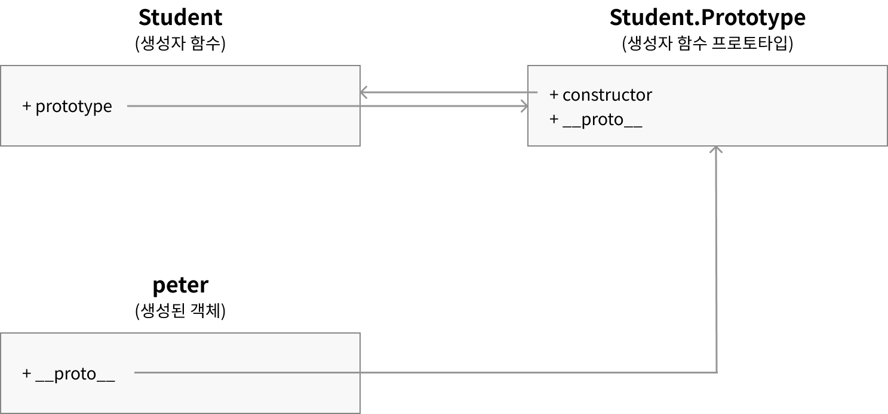

이번 글은 [[JS] 프로토타입(Prototype)](https://wlswoo.tistory.com/52)을 바탕으로 작성한 글이다. 이전에도 프로토타입에 괸련된 글을 썼지만 감을 잡지 못하면 어렵고 헷갈리는 부분이다.

자바스크립트는 우리가 익숙한 자바와는 달리 **프로토타입 기반의 객체지향**을 지원한다. 클래스 기반의 객체지향과 차이점이라면 `class`가 없다.

_자바스크립트는 `class`가 있는데?_ 라고 생각할 수 있지만 이번 글에서 프로토타입을 다루며 함께 작성해보려 한다.

## 프로토타입

원본 객체를 원형으로 복제하여 객체를 만드는 구조를 프로토타입 기반 객체지향이라고 한다.

사실 이렇게 보면 무슨말인지 절대 모른다. 이제 천천히 예제를 통해 알아보자.

### 왜 프로토타입을 사용할까?

ES6의 `class`문법의 등장 전까지만 해도 **생성자 함수**를 통해 동일한 객체를 만들어 냈다.

```javascript
function Student(name, age) {
  this.name = name;
  this.age = age;
}

new Student('name', 10);
```

이렇게 사용했는데 만약 `Student` 생성자 함수에 `type`이라는 고정된 값이 적용된다면?

```javascript
function Student(name, age) {
  this.type = {
    key: 'Student',
    name: '학생',
  };
  this.name = name;
  this.age = age;
}

const peter = new Student('peter', 17);
const john = new Student('john', 18);

console.log(peter.type === john.type); // false
```

`peter`와 `john`의 `type`프로퍼티의 주소는 다른 주소를 가진다.

```javascript
const peter1 = new Student('peter1', 17);
const peter2 = new Student('peter2', 18);
.
.
.
const peter100 = new Student('peter100', 19);
```

만약 객체가 100개 만들어진다면? 각각 새로운 메모리에 `type`이 100번 만들어지게된다. 이런 문제를 해결하기 위해 **프로토타입을 사용**한다.

```javascript
function Student(name, age) {
  this.name = name;
  this.age = age;
}

Student.prototype.type = {
  key: 'Student',
  name: '학생',
};

const peter = new Student('peter', 17);
const john = new Student('john', 18);

console.log(peter.type === john.type); // true
```

`Student.prototype.type`을 만들어 값을 할당했고 `peter.type`처럼 `Student.prototype.type`에 접근했다.

그리고 `peter.type`과 `john.type` 객체는 같은 메모리를 사용하고 있다.

```javascript
Student.prototype {
  type: ...
}
```

`Student.prototype`이란 객체를 프로토타입으로 `new Student(...)`에서 접근할 수 있도록 했다. 이런 방식이 프로토타입 방식이다.

#### prototype 접근하기

위 예제에서 `peter.type`이 어떻게 `Student.prototype.type`으로 접근했을까?

이제 본격적으로 프로토타입을 알아볼 차례이다.

### prototype

**함수도 객체**이다. 함수는 개발자가 접근할 수 없는 `[[Call]]`이라는 내부 메서드를 가진 **호출 가능한 객체**이다.

생성자 함수(함수가 모두 생성자 함수는 아님)는 `[[Construct]]`라는 내부 메서드를 추가로 가지는데 `new`와 함께 사용했을때 호출된다.

함수도 객체이므로 프로퍼티가 있고 생성자 함수는 `prototype`이라는 프로퍼티를 이미 가지고 있다.

### \_\_proto\_\_

프로토타입 링크이다. 아까의 궁금증이 이제 풀리는 순간이다. `__proto__`는 모든 객체가 가지는 **프로토타입 링크**라는 프로퍼티이다.

`__proto__`라는 프로퍼티를 통해 `생성자 함수의 prototype (Student.prototype)`에 접근할 수 있다.

> 참고
>
> `Object.create(null)`의 반환값은 프로토타입이 없는 객체로 `__proto__` 링크가 없음

```javascript
function Student(name, age) {
  this.name = name;
  this.age = age;
}

Student.prototype.type = {
  key: 'Student',
  name: '학생',
};

const peter = new Student('peter', 17);

console.log(peter.__proto__.type); // { key: 'Student', name: '학생' }
console.log(peter.__proto__ === Student.prototype); // true
```

`peter.__proto__`와 `Student.prototype`은 연결되어 같은 값이다.

또한 `__proto__`는 생략가능하기에 `peter.(__proto__).type`으로 접근할 수 있는 것 이다.

### constructor

`Student.prototype.constructor`이라는 값은 기본적으로 생성자함수에게 부여되는 프로퍼티이다.

생성자 함수 자신을 가르키는 값인데 생성된 객체에서 자신의 생성자 함수를 알 수 있다.

```javascript
// 위 예제
console.log(Student.prototype.constructor === Student); // true
console.log(Student.prototype.constructor === peter.constructor); // true
```

프로토타입에 관련해 정리된 그림이지만 사실 난 봐도 잘 모르겠다. 예제가 더 편하긴 했다.



`Student.prototype`에 `__proto__`라는 링크가 있는건 `Student.prototype` 또한 객체이기에 `__proto__` 내부 링크가 존재한다.

### class 문법

ES6에서 `class`를 지원하기 시작했다.

```javascript
class Student {
  constructor(name, age) {
    this.name = name;
    this.age = age;
  }
}
```

자바와 유사한 문법으로 지원하지만 내부적으로 프로토타입 기반으로 구현되어있다.

```javascript
class Rectangle {
  static shape = '사각형';

  constructor(width, height) {
    this.width = width;
    this.height = height;
  }

  getArea() {
    return this.width * this.height;
  }
}
```

`static`과 내부 메서드를 작성한 `Rectangle`을 프로토타입으로 작성한다면 아래와 같을 것이다.

```javascript
function Rectangle(width, height) {
  this.width = width;
  this.height = height;
}

Rectangle.prototype.getArea = function () {
  return this.width * this.height;
};

Rectangle.shape = '사각형';
```

이렇게 구현할 수 있다. 물론 `extends`를 통해 상속이 추가되면 더 복잡해질 것이다.

하지만 중요한건 `class`도 프로토타입으로 이루어져있다는 것이다.
