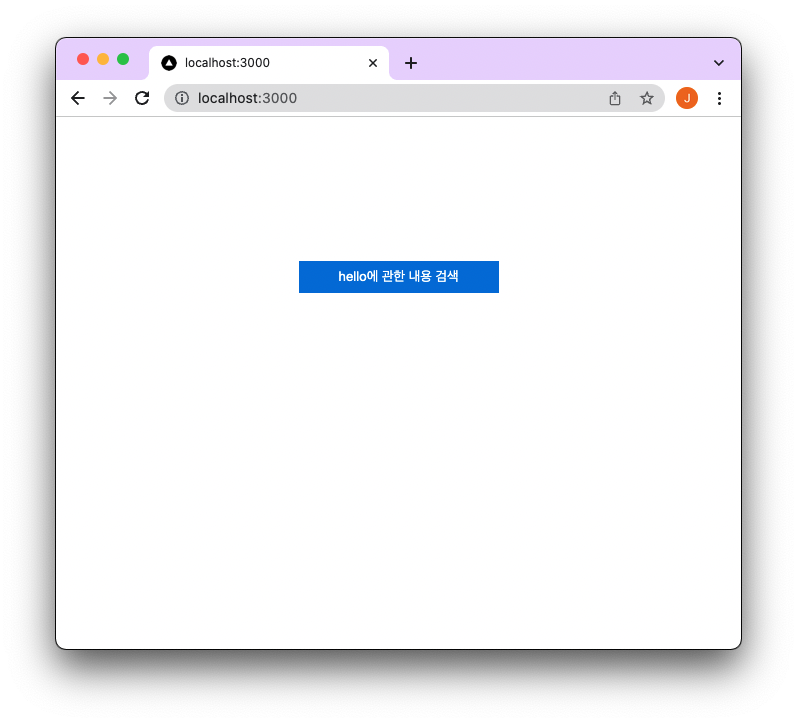
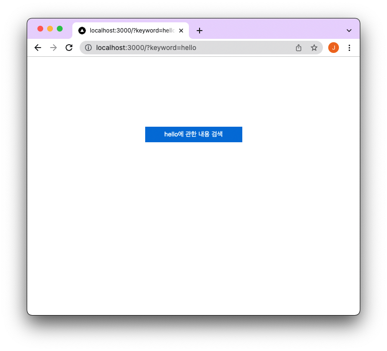
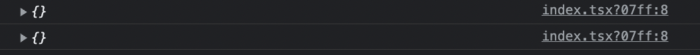
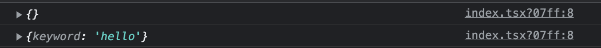

오늘은 몇일 전 회사에서 `router.push` 후 `router.query`가 `{}`로 바뀐 이슈에 대해서 정리하려고 한다

문제가된 코드는 아래와 같다.

```jsx
import { useRouter } from 'next/router';

const Home = () => {
  const router = useRouter();

  return (
    <div>
      <button
        onClick={() => {
          router.push(router.pathname, {
            query: {
              keyword: 'hello',
            },
          });
        }}
      >
        hello에 관한 내용 검색
      </button>
    </div>
  );
};

export default Home;
```

버튼을 클릭 시 `{pathname}?keyword=hello`로 이동한다.

UI는 아래와 같다.



버튼을 클릭하면 `keyword=hello` 라는 query가 추가된걸 확인할 수 있다.



```jsx
useEffect(() => {
  console.log(router.query);
}, [router.query]);
```

중간에 `router.query`의 변화를 확인하기 위해서 `useEffect`을 추가했다.

`router.query`가 변할때다마다 `console.log`를 찍어보면 아래와 같은 결과를 확인할 수 있다.



초기 로딩 시 `{}`가 한번 찍히고 버튼 클릭 시 `{}`가 한번 찍힌다.

분명 `keyword=hello` 라는 값이 존재하는데 왜 `{}` 빈 객체가 찍힐까? 또 어떻게 원래 의도대로 동작하게 할까?

#### 정상적으로 동작하게 하기

먼저 정상 동작하는 방법부터 알아보자

```jsx
import { useRouter } from 'next/router';
import { useEffect } from 'react';

const Home = () => {
  const router = useRouter();

  useEffect(() => {
    console.log(router.query);
  }, [router.query]);

  return (
    <div>
      <button
        onClick={() => {
          router.push({
            pathname: router.pathname,
            query: {
              keyword: 'hello',
            },
          });
        }}
      >
        hello에 관한 내용 검색
      </button>
    </div>
  );
};

export default Home;
```



`router.push({ ... })` 처럼 첫번째 인자에 객체로 값을 전달하면 정상적으로 작동한다.

#### as 매개변수

[Next.js Router 문서](https://nextjs.org/docs/api-reference/next/router#routerpush)를 보면 두번째 인자는 `as`라는 이름의 매개변수이다.

브라우저에 보일 URL을 옵셔널로 설정할 수 있는 매개변수라고 설명하고 있다.

> Optional decorator for the path that will be shown in the browser URL bar.

이슈가 발생한 이유를 정리해보자면 두번째 인자로 query를 넘겨주어 URL에만 반영되고 실제 `router.query`엔 반영되지 않는 문제였다.
