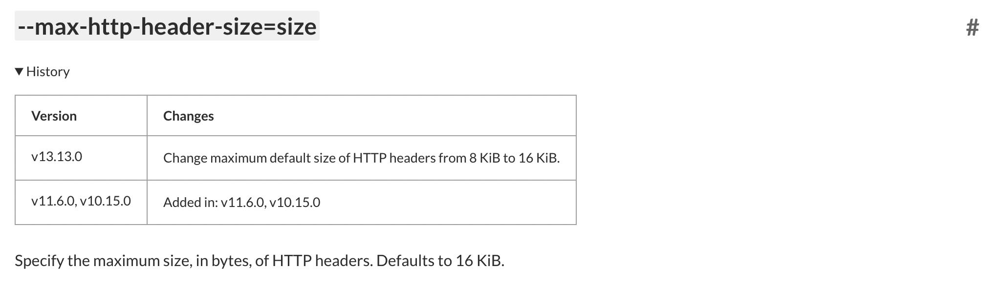
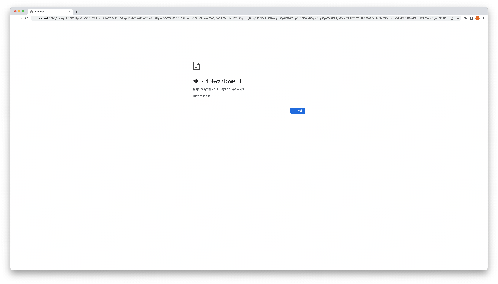

오늘 회사에서 `window.location.href = ...` 코드를 실행했을때 빈 화면이 나오는 이슈가 있었다.

확인해보니 페이지를 받아오지 못하고 `HTTP 431` 오류가 내려오고 있었다.

### HTTP 431 (Request Header Fields Too Large)

HTTP Status 431은 HTTP 헤더의 크기가 너무 큰 경우 발생하는 오류이다.

[MDN 문서](https://developer.mozilla.org/ko/docs/Web/HTTP/Status/431)에 더 자세히 설명되어 있지만 결국 헤더 크기가 문제였던 것이다.

현재 회사 코드에서 크기가 굉장히 큰 데이터를 querysting으로 전달하고 있었다. 이로 인해서 요청 헤더가 특정 제한 이상으로 커지게 되어 발생했던 오류였다.

### HTTP?

그렇다면 이런 요청 헤더 크기를 제한하는건 HTTP일까?

조금만 찾아보면 알 수 있다. **HTTP는 요청 헤더 크기에 제한을 두지 않는다.**

다만 각각의 웹서버가 크기를 제한한다.

### Node.js!

요청 헤더 크기를 제한하는건 `Node` 였다.



위 그림에서 볼 수 있듯 Node는 16KiB로 헤더크기를 제한하고 있다.

현재 회사에선 `Next.js`를 사용하여 `Node` 환경에서 서버가 실행된다.  
그렇기 때문에 당연히 헤더크기가 Node의 최대치를 넘으면 오류가 난다.

##### Node.js 서버로 확인하기

간단한 Node.js 서버를 만들어 확인해보자.

```javascript
// server.js
const http = require('http');

http
  .createServer((request, response) => {
    response.writeHead(200);
    response.end();
  })
  .listen(3000);
```

아래 명령어로 서버를 실행해주자.

```sh
> node server.js
```

실행되고 있는 서버 `http://localhost:3000`으로 요청 시 성공 응답(Status 200)을 받을 수 있다.

하지만 `http://localhost:3000?query=엄청_큰_데이터` 이렇게 엄청 큰 데이터를 query로 함께 보낸다면



이렇게 HTTP 432 오류를 응답받을 수 있다.

## 해결 방법

`Node.js`에서 제공하는 옵션을 통해 해결할 수 있다.

[Node.js CLI 문서](https://nodejs.org/api/cli.html#--max-http-header-sizesize)의 `max-http-header-size`라는 옵션이 제공된다.

`--max-http-header-size={size}`와 같이 사용할 수 있는데 이 옵션으로 사이즈를 지정할 수 있다.  
size의 단위는 바이트이다.

```sh
> NODE_OPTIONS=--max-http-header-size=32768 node server.js
```

아래와 같이 서버를 실행한다면 설정한 값만큼 요청 헤더의 크기를 제한할 수 있다.
