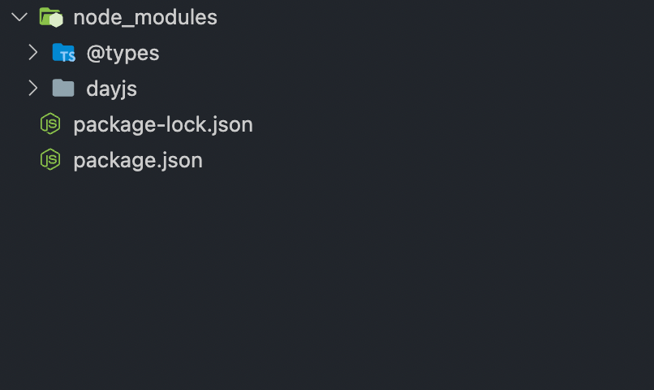
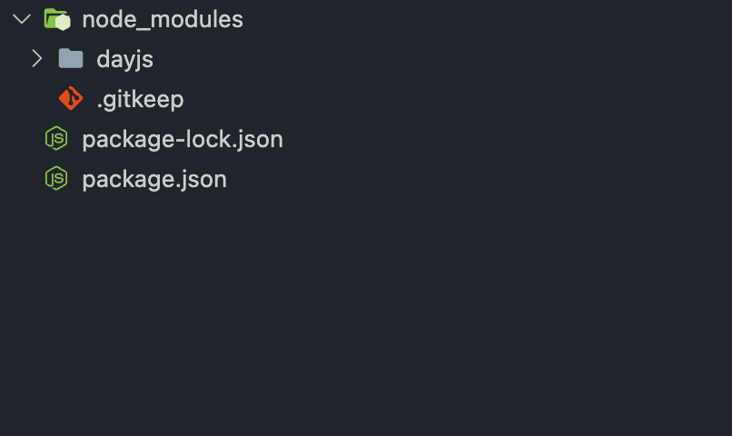

개발을 하다보면 `npm install --dev {package}` 처럼 `--dev` 옵션을 붙여주는 경우가 종종 있다.

이렇게 설치하게 되면 `package.json`의 `devDependency`에 들어가게된다.

```json
"devDependencies": {
  "prettier": "2.4.1",
  ...
},
```

`devDependencies`과 `dependencies`의 차이는 뭔지, 또 `peerDependencies`라는건 뭔지 정리해봤다.

### dependencies

`dependencies`는 일반적으로 `npm install {package}`로 설치할 수 있다.

```shell
$ npm install dayjs
```

이렇게 설치된 `dependencies` 실제 런타임에서 사용되는 패키지이다..

### devDependencies

`devDependencies`는 `--dev` 옵션을 주어 설치한다.

```shell
$ npm install --dev @types/node
```

실제 런타임에서 사용되지 않으나 빌드와 같은 작업에서 필요한 패키지일 경우 `devDependencies`로 구분해 설치할 수 있다.

### dependencies vs devDependencies

위에서 언급했듯 런타임 사용여부에 따라 구분해 설치할 수 있다.

```json
{
  "dependencies": {
    "dayjs": "1.11.1"
  },
  "devDependencies": {
    "@types/node": "17.0.25"
  }
}
```

이렇게 두 패키지가 각각 `dependencies`와 `devDependencies`로 설치돼 있을때 아래 명령어들에 대한 결과를 비교해보자

```shell
$ npm install
```

(`node_modules` 재설치 시 `node_modules` 결과물)


정의된 패키지를 모두 설치한 결과이다.

이번엔 `dependencies`만 설치하도록 옵션을 넣어줬다.

```shell
$ npm install --production
```

(`node_modules` 재설치 시 `node_modules` 결과물)


> .gitkeep은 무시

`--production` 옵션을 통해 `dependencies`만 설치할 수 있다. 이렇게 설치했을때 런타임시 필요한 패키지만 빠르게 설치할 수 있는 장점이 있다.

### peerDependencies

`peerDependencies`는 실제로 `import`되어 사용하진 않지만 특정 버전과 호환되도록 개발된 패키지를 명세한다.

내가 패키지를 만들어 배포할때 특정 패키지의 버전에 의존한다면 (다른 글에선 플러그인이라고 표현하는 곳도 있다.) `peerDependencies`에 정의할 수 있다.

`npm@6`까진 `peerDependencies`가 맞지 않다면 경고문구를 표시하며 `npm@7`부터는 오류를 발생한다.
