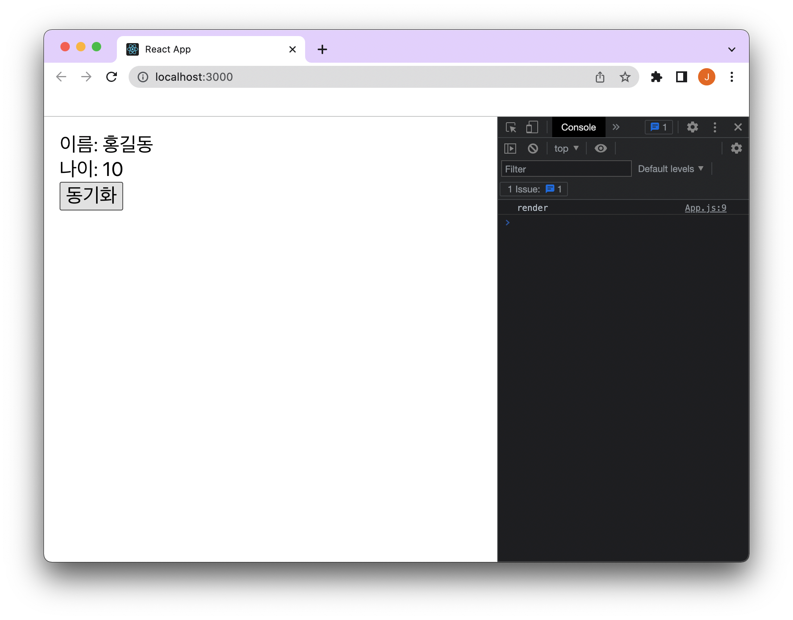

2022년 3월 29일 React 18버전이 공식적으로 `npm`에 릴리즈 됐다.

어떤 새로운 기능과 변경이 있는지 간단하게 정리해보려고 한다.

참고로 [React v18.0 관련 React 공식 블로그](https://reactjs.org/blog/2022/03/29/react-v18.html)에 더 상세한 내용을 확인할 수 있다.

### Automatic Batching

기존 React는 React의 이벤트 핸들러 내에서만 업데이트를 일괄로 처리해 렌더링했다.

```jsx
function App() {
  const [name, setName] = useState('-');
  const [age, setAge] = useState(0);

  useEffect(() => {
    console.log('render');
  });

  return (
    <div className="app">
      <div>이름: {name}</div>
      <div>나이: {age}</div>
      <button
        onClick={() => {
          setAge(10);
          setName('홍길동');
        }}
      >
        동기화
      </button>
    </div>
  );
}
```



동기화 버튼을 눌렀을때 `setName`과 `setAge` 두개를 실행해도 한번 리렌더링된다.

기존에도 React의 이벤트 핸들러에선 여러 `setState`를 한번에 적용했다.

단, 그 외의 조건에선 배치 시스템이 작동하지 않았다.

```jsx
function App() {
  const [name, setName] = useState('-');
  const [age, setAge] = useState(0);

  useEffect(() => {
    console.log('render');
  });

  return (
    <div className="app">
      <div>이름: {name}</div>
      <div>나이: {age}</div>
      <button
        onClick={() => {
          setTimeout(() => {
            setAge(10);
            setName('홍길동');
          }, 0);
        }}
      >
        동기화
      </button>
    </div>
  );
}
```


`setTimeout`에서 `setName`와 `setAge`를 실행하니 두번 리렌더링된다.

이런 부분을 React18에서는 개선했다.

**`setTimeout`이나 `Promise`에서도 배치 시스템이 작동하며 한번 리렌더링된다.**

### Transition

React에서는 긴급한 업데이트와 긴급하지 않은 업데이트로 분류해 우선순위를 부여하는 `transition`이라는 기능을 업데이트했다.

긴급한 업데이트가 먼저 이루어지고 긴급하지 않은 업데이트는 pending될 수 있는 것 같다.

사용법은 두가지로 이루어지고 `useTransition` hooks와 `startTransition` 함수이다.
hooks를 사용할 수 있는 환경이라면 `useTransition` hooks 사용을 권장하는 것 같다

```jsx
function App() {
  const [input, setInput] = useState('');
  const [result, setResult] = useState('');
  const [isPending, startTransition] = useTransition();

  return (
    <div>
      <input
        value={input}
        onChange={e => {
          setInput(e.target.value);
          startTransition(() => {
            setResult(e.target.value);
          });
        }}
      />
      {isPending ? '로딩 중' : result}
    </div>
  );
}
```

이런식으로 `input`의 `value`로 연결된 부분은 긴급하게 업데이트가 필요하다.

하지만 `value`의 변경으로 인한 Result는 긴급한 업데이트는 아니므로 `transition`에 넣어서 우선순위를 조정할 수 있다.

`useTransition` hooks를 사용하면 `[isPending, startTransition]`을 반환 받는다.

실제로 사용해봤을때 `isPending`으로 `로딩 중`이라는 문구가 보이는 시간은 굉장히 짧았다. 우선순위를 조정해 어떻게 사용할지는 조금 더 지켜봐야할 것 같다.

### New Hooks

##### useId

`useId` hooks를 통해서 고유한 ID를 만들어 낼 수 있다.

```jsx
import { useId } from 'react';
.
.
.

const id = useId();
.
.
```

##### useTransition

이전에 소개한 `useTransition` hooks도 새롭게 추가됐다.

```jsx
import { useTransition } from 'react';
.
.
.

const [isPending, startTransition] = useTransition();
.
.
```

추가로 몇가지 hooks들이 새롭게 지원된다. 자세한 내용은 [React 공식 블로그 New Hooks](https://reactjs.org/blog/2022/03/29/react-v18.html#new-hooks)에 정리되어있다.

React 블로그에도 동시성에 대한 내용으로 글을 시작하는 만큼 관련된 업데이트가 많이 이루어진 것 같다.

`ReactDOM.render`이 바뀐 부분이나 `Suspense`에 관련된 업데이트도 있는 것 같은데 새로워보이는 기능 위주로 정리해봤다.

더 자세하고 많은 내용은 [React v18.0 관련 React 공식 블로그](https://reactjs.org/blog/2022/03/29/react-v18.html)에서 확인해보면 좋을것 같다.

짧게 React18 변경점을 훑어봤는데 앞으로 사용하며 글로 남길만한 내용이 있다면 남겨야겠다.
