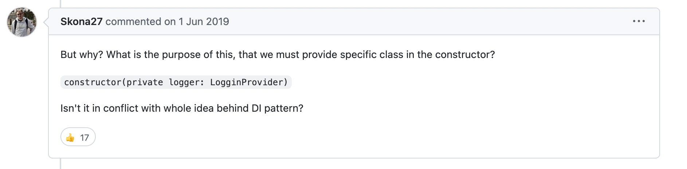

> **typeDI 라이브러리를 사용하며 느낀 문제점에 대한 생각을 작성한 글이다.**

typescript에서 의존성 주입과 제어의 역전을 쉽게하기 위한 라이브러리로 [typeDI](https://github.com/typestack/typedi)가 있다.

이런 라이브러리를 통해 의존성 주입과 제어의 역전을 하는 이유는 객체간의 결합도를 낮추기 위함이다.

의존성 주입과 제어의 역전을 아래 코드를 통해 가볍게 짚고 넘어가보자.

### 의존성 주입과 제어의 역전

간단히 로그를 남겨야하는 경우 아래와 같이 `Logger` 클래스를 구현해 로그를 남길 수 있다.

```typescript
// logger.ts
class Logger {
  info(message: string) {
    console.log(message);
  }

  error(message: string) {
    console.log(message);
  }

  warn(message: string) {
    console.log(message);
  }
}

// user.ts
class User {
  private logger = new Logger();

  create() {
    // do something
    this.logger.info('회원 생성 성공!');
  }
}
```

그렇다면 `console`이 아닌 `file`로 로그를 남기고 싶다면 아래와 같이 수정해야된다.

```typescript
// logger.ts
class FileLogger {
  info(message: string) { ... }
  error(message: string) { ... }
}

// user.ts
class User {
  private logger = new FileLogger();

  create() {
    // do something
    this.logger.info('회원 생성 성공!');
  }
}
```

이 경우 두가지 **문제**가 있다.

1. 만약 User 클래스 뿐만 아니라 다양한 곳에서 Logger가 사용됐다면 교체에 더 많은 비용이 들었을 것 이다.
2. 또 FileLogger 클래스의 인터페이스가 기존의 Logger 클래스와 달랐다면 사용되는 모든 곳들을 확인해주어야한다. (**위 예제에서 FileLogger는 `warn` 메소드를 지원하지 않는다**)

#### interface로 구현의 강제성 가지기

일단 두번째 문제를 interface를 통해서 해결할 수 있다.

```typescript
// logger.ts
interface ILogger {
  info(message: string): void;
  error(message: string): void;
  warn(message: string): void;
}

class FileLogger implements ILogger {
  info(message) { ... }
  error(message) { ... }
  warn(message) { ... }
}

// user.ts
class User {
  private logger = new FileLogger();

  create() {
    // do something
    this.logger.info('회원 생성 성공!');
  }
}
```

이렇게 인터페이스를 사용하면 구현이 강제화되어 위 2번과 같은 문제는 발생하지 않는다.

그렇다면 1번은 어떻게 해결할 수 있을까?

#### 의존성 주입을 통해 느슨하게 결합하기

```typescript
// logger.ts
interface ILogger {
  info(message: string): void;
  error(message: string): void;
  warn(message: string): void;
}

class FileLogger implements ILogger {
  info(message) { ... }
  error(message) { ... }
  warn(message) { ... }
}

// user.ts
class User {
  private logger: ILogger;

  constructor(logger: ILogger) {
    this.logger = logger;
  }

  create() {
    // do something
    this.logger.info('회원 생성 성공!');
  }
}

// main.ts
const fileLogger = new FileLogger();
new User(fileLogger);
```

이렇게 로거를 **외부에서 주입받아 사용**한다.

느슨한 결합을 위해 User의 logger 타입은 인터페이스이며 `ILogger` 인터페이스를 구현한 클래스의 객체는 모두 주입받을 수 있다.

`FileLogger`를 `ConsoleLogger`로 교체하는 작업도 굉장히 쉬워진다.

```typescript
// logger.ts
interface ILogger {
  info(message: string): void;
  error(message: string): void;
  warn(message: string): void;
}

class ConsoleLogger implements ILogger {
  info(message) { ... }
  error(message) { ... }
  warn(message) { ... }
}

// user.ts
class User {
  private logger: ILogger;

  constructor(logger: ILogger) {
    this.logger = logger;
  }

  create() {
    // do something
    this.logger.info('회원 생성 성공!');
  }
}

// main.ts
const consoleLogger = new ConsoleLogger();

new User(consoleLogger);
```

실제 인스턴스만 바꿔서 주입해준다면 `User` 클래스 코드는 수정이 전혀 필요없다.

#### 제어의 역전

User에서 logger 객체를 만들어 사용하지 않고 위 예제와 같이 User 객체를 사용하는 곳에서 User 객체가 사용할 객체들을 생성해서 주입하고 있다.

이런식으로 제어권이 뒤바뀐것을 제어의 역전(IoC)라고 한다.

의존성 주입과 제어의 역전 설명은 여기까지만 하고 typeDI에 관련된 내용으로 넘어가보겠다.

### TypeDI 뭐가 문제일까?

우선 typeDI의 사용법은 [공식문서](https://github.com/typestack/typedi)에 잘 설명되어 있으나 아래를 통해 간단히 뉘앙스만 알아보자

```typescript
import { Service, Container } from 'typedi';

@Service()
class Logger {
  info(message: string) { ... }
  error(message: string) { ... }
  warn(message: string) { ... }
}

@Service()
class User {
  constructor(
    private logger: Logger,
  ) { }

  create() {
    // do something...
    this.logger.info("회원 생성 성공!");
  }
}

new User(Container.get(Logger)).create();
```

이렇게 User에서 생성자 주입 방식을 통해 주입받아 사용할 수 있다.

하지만 문제는 인터페이스를 사용할 수 없다는 것이다.

```typescript
import { Service, Container } from 'typedi';

interface ILogger {
  info(message: string): void;
  error(message: string): void;
  warn(message: string): void;
}

@Service()
class ConsoleLogger implements ILogger {
  info(message: string) { ... }
  error(message: string) { ... }
  warn(message: string) { ... }
}

class User {
  constructor(
    private logger: ILogger,
  ) { }

  create() {
    // do something...
    this.logger.info("회원 생성 성공!");
  }
}

new User(Container.get(ILogger)).create();
```

이렇게 사용한다면 오류가 발생한다.

위 이슈는 [typeDI Github의 이슈](https://github.com/typestack/typedi/issues/70)로 등록되었지만 현재는 closed 처리 되었다.

개발자의 답변은 인터페이스는 런타임에서는 빈 객체가 되어 인터페이스로 찾을 수 없다는 것이다.

생각해보면 당연한 이야기 같다. javascript로 트랜스파일링 됐다면 실제로 런타임에서 인터페이스는 존재하지 않으며 IoC Container에서 찾을 수 없기 때문이다.

다만 이런 경우 우리는 인터페이스를 통해서 느슨히 결합하기는 힘들다. 그 이유는 위 의존성 주입 부분을 통해 쉽게 이해할 수 있다.

오늘 typeDI를 사용하며 개발하던 중 이런 문제를 발견했고 나와 비슷한 생각을 하는 사람들을 볼 수 있었다.



사실 다른 DI라이브러리를 찾는다고 해도 다른 방식으로 풀었을지는 몰라도 비슷한 이슈는 있을 것 같다.

그래서 그냥 그대로 사용할 예정이지만 의존성 주입 패턴의 이점을 100% 활용할 수는 없을 것 같다.
