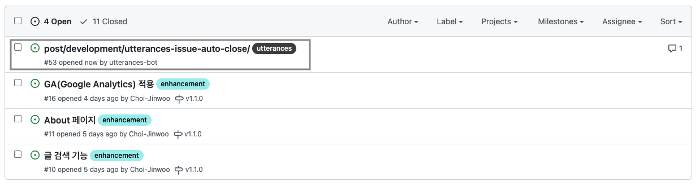
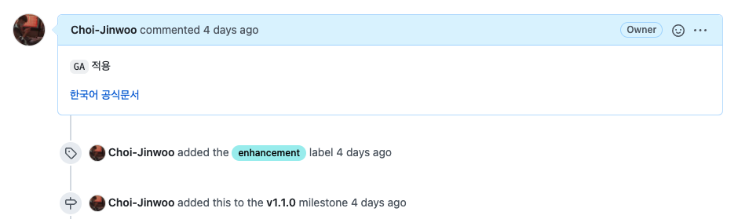
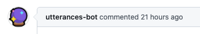
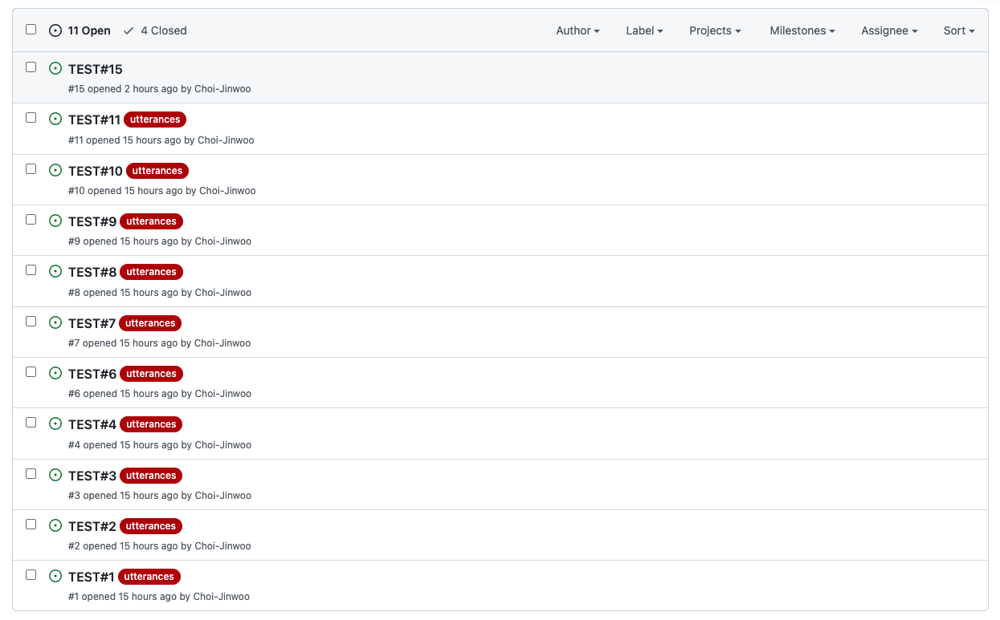

저번에 [Utterances로 블로그 댓글 만들기](/post/development/apply-utterances-in-blog/)를 했었다.

다 좋았고 만족하며 쓰고 있었다. 근데 딱 하나 거슬리는게 있었는데 이슈를 닫아주지 않았다.


사실 `Github Issues` 탭을 사용하지 않으면 크게 신경 쓸 부분이 아니다.

하지만 난 `Github Issues`를 통해 이슈관리를 했기에 중간중간있는 utterances issue가 **거슬렸고 닫아주기로 했다.**



### Close Issue

`Github Actions`를 통해 자동화를 하려고 했다.

이슈를 닫는 Actions가 있는지 찾아보니 [Close Issue](https://github.com/marketplace/actions/close-issue)라는게 있었다.

읽어보니 사용법도 간단했고 이슈를 닫아주는 목적에도 충실했다.

## Label을 통해 닫자 (실패)

### issue가 발행되면 label을 확인해 닫아보자

`utterances`는 issue를 발행하면 설정한 `label`을 함께 달아준다.

나는 `utterances`라는 라벨을 설정했고 처음 생각한 방식은 이 라벨을 이용한 방법이다.

- 이슈 발행
- 이슈의 라벨이 `utterances`일 경우 `Close Issue` 실행

이 방법으로 실험해보니 문제가 있었다.



이슈를 발행할때 라벨을 달아도 순서는 `이슈발행 > 라벨추가 > 마일스톤추가 > ...`처럼 발행 후 다음 작업들이 이루어진다.

그럼 이슈가 `opened` 즉 발행 시점엔 `label`이 없다는 문제였다.

### issue에 label이 붙으면 label을 확인해 닫아보자

그렇다면 이슈가 발행됐을때가 아닌 label이 붙는 시점으로 설정해 `Actions`를 구동해봤다.

```yml
name: Close utterances issue
on:
  issues:
    types: [labeled]
jobs:
  close-issue:
    runs-on: ubuntu-latest
    steps:
      - if: github.event.label.name == 'utterances'
        name: Close Issue
        uses: peter-evans/close-issue@v1
```

테스트해보니 `label`이 붙을때마다 실행되어 `utterances`라벨이 붙으면 이슈를 닫아줬다.

생각대로 동작했고 `production`에 적용했다.

잘되나 싶었지만 **문제가 있었다.**

내가 아닌 다른 사람이 댓글을 작성하면 `label`이 붙지 않았다.

정확한 이유는 모르겠지만 글에 다른사림이 처음 댓글을 작성해 이슈가 발행된다면 `label`이 붙지 않았다. 다른 방법을 찾아야 했다.

## 발행자를 통해 닫자 (성공)

`label`을 통해선 힘들다고 판단했고 고민에 잠겼는데 그때 발행자가 눈에 들어왔다.



`utterances`에 관련된 issue는 `utterances-bot`이 발행한다.

그렇다면 _이슈가 발행됐을때 발행자를 확인해보면 되지 않을까?_ 라는 생각을 했다.

```yml
name: Close utterances issue
on:
  issues:
    types: [opened]
jobs:
  close-issue:
    runs-on: ubuntu-latest
    steps:
      - if: github.event.issue.user.login == 'utterances-bot'
        name: Close Issue
        uses: peter-evans/close-issue@v1
```

실제 적용해보니 `production` 환경에서도 잘 동작했다.


관련된 이슈를 actions가 잘 닫아준다.

## 후기



글에선 다루지 않았지만 테스트를 위한 레포지토리를 만들어 꽤 다양한 시도를 했었다.

처음 `utterances`를 사용했을때 이슈를 자동으로 닫고 싶어하는 사람이 있을 것이라 생각했다. 하지만 예상과 달리 관련된 글은 잘 보이지 않았다.

그래서 내가 직접해보고 글을 올리겠다고 생각했고 막상 해보니 어려운 작업은 아니었다.

역시 귀찮은일을 자동화하는건 기분 좋은 일이다.
