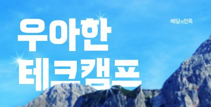
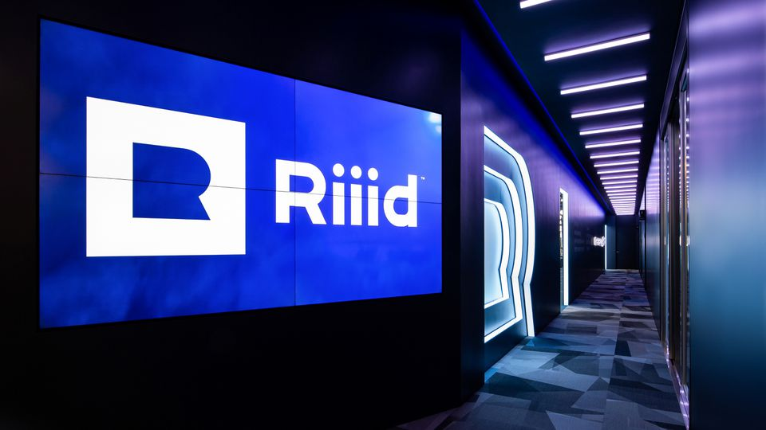

2021년이 저문 지 2달이 지나서야 회고를 쓰게 됐다. 고등학교 3년 동안 매년 회고를 썼고 앞으로도 계속 쓸 예정이다.

여러 플랫폼을 거쳐오다 보니 회고가 여기저기 흩어져있어 일단 모아봤다.

- [2019 회고](https://velog.io/@chlwlsdn0828/%ED%9A%8C%EA%B3%A0)
- [2020 회고](https://wlswoo.tistory.com/21?category=861945)

이제 본격적으로 **2021년 회고**를 시작해보겠다.

### 3학년, 취업 준비

1학년 땐 막연히 오지 않을 것 같았던 3학년이 되었다. 어느새 나도 회사를 알아보고 구인구직 사이트를 매일 확인하고 있었다.

처음엔 학교를 **제일 먼저 나가고 싶었다.** 조금이라도 빨리 실무 경험을 쌓고 싶었다.

노션을 통해 백엔드 포트폴리오를 준비하고 여러군데 회사를 지원했다. 실제로 처우협의 단계까지 갔던 회사도 있었지만 상황 상 입사까지 이뤄지진 않았다.

### 우아한 테크캠프

취업 준비 중 [우아한 형제들 & IT 고등학교 협약](https://biz.chosun.com/site/data/html_dir/2021/04/09/2021040901742.html)이 이루어져 나도 우아한 캠프에 지원할 기회가 생겼다.

처음엔 별생각 없었다. 흔히 `네카라쿠배`에서 `배`를 담당하는 만큼 좋은 문화와 경쟁력있는 서비스를 운영하고 있지만 `우아한 테크캠프 선발 준비 + 우아한 테크캠프 + 정규직 전환 채용`까지 한다면 너무 긴 여정이 될 것 같았다.

또 프론트엔드 중심 교육이었고 당시에 백엔드 위주로 취업준비를 했기에 더 고민됐다.

하지만 주위에서 테크캠프를 하게되면 그것만으로 좋은 경험이라고 많이 말해줬고 나도 결국 신청하게됐다.

##### 2번의 코딩 테스트와 1번의 면접

1차, 2차 코딩 테스트를 봤고 면접도 봤다. 모든 선발 과정을 마친 후 합격 통보를 받았다.

**그렇게 우아한 테크캠프 4기 교육생이 되었다.**

총 40명이 함께 했고 2주씩 총 4번의 실무형 협업 프로젝트를 진행하게 됐다.

- [과제 1 회고](https://wlswoo.tistory.com/78)
- [과제 2 회고](https://wlswoo.tistory.com/79)
- [과제 3 회고](https://wlswoo.tistory.com/80)
- [과제 4 회고](https://wlswoo.tistory.com/82)

각 과제를 진행한 후 작성한 회고글이다.

당시에 밤을 새거나 주말까지 개발하며 시간이 없던 와중에 작성해 조금 내용이 짧을 수 있다. (이때 이후 몸이 조금 안좋아졌다)

테크캠프를 진행하며 `Javascript`의 중요성을 많이 느꼈다.

또 우아한 형제들 출신 멘토님에게 좋은 책들도 추천 받아 사서 봤고 좋은 말들도 많이 들었다.

##### 정규직 전환 채용

2달간의 교육이 끝나고 정규직 전환에 대한 채용이 시작됐다. 1차 기술 면접과 2차 임원 면접으로 이루어졌다.  
1차 기술 면접은 잘 준비해서 통과했지만 2차 임원 면접에서 아쉽게 **떨어지게 됐다.**

이때 많이 낙담했다. 우아한 테크캠프 준비부터 정규직 채용까지 약 6 ~ 7개월을 쏟아부었기 때문이다. 많이 아쉬웠다.

이때 이후 멘탈도 많이 깨졌고 주변 친구들도 모두 취업해 떠나는 마당에 마음이 급해져 일명 **무지성 지원**, 보이는 회사를 족족 지원했다.

멘탈이 어느정도 회복되고 느낀점은 두가지였다.

**내가 회사를 떨어진건 회사와 내 핏이 맞지 않구나**

- 다른 두 퍼즐 조각이 안맞을 수도 있고 둘 중 하나가 잘못된 퍼즐 조각은 아니다. 각자 자리는 있고 그 자리를 찾듯 또 다른 회사를 찾으면 된다.

**마음이 급할 필요 없다**

- 급하게 취업할 필요가 없다. 한두 달 늦게 취업한다고 생기는 문제가 있을까?

이정도를 느끼게 됐고 이후엔 꽤 마음이 편해졌다.

### 다시 취업 준비

백엔드로 취업을 준비했지만 우아한 테크캠프를 통해서 웹 프론트엔드 개발자로 커리어를 시작하기로 했다.

지금 결정이 어떻게 작용할진 모르지만 풀스택 개발자를 지향하기에 큰 문제는 없다고 생각했다.

멘탈이 회복되고난 후 다시 회사를 지원했다. 예전에 떨어진 회사도 지원했다.

꽤 여러군데에서 과제를 받고 면접을 하게 됐다. 그 중엔 채용 과정이 불친절해 합격한 후 거절한 회사도 있었다.

최종적으로 2군데를 합격하게 됐고 큰 고민 없이 평소 눈여겨보던 회사에 입사를 결정했다.

### Riiider

입사를 결정한 회사는 `Riiid`라는 AI EdTech 스타트업이다. [세계 100대 AI스타트업](https://www.news1.kr/articles/?4220805)으로 인정받을 정도의 기술력을 가진 스타트업이다.

1월 17일 입사해 현재 1달 정도 Riiid에서 Frontend Engineer로 함께하고 있다.

### 이전 목표와 새로운 목표

작년 목표의 성취율을 확인해보고 새로운 목표를 설정해보겠다.

##### 2021 목표 성취 회고

- **좋은 회사 취업하기** 좋은 분들과 함께하고 있고 앞으로 많이 배우고 성장하고싶다. ✅
- **알고리즘 공부하기** 사실 조금 애매하지만 중간중간 꽤 풀었기 때문에 성취이다. ✅
- **기본기 다지기** 자바스크립트에 대해 많이 공부했고 네트워크나 자료구조도 공부했다. ✅
- **요리배우기** 여전히 배우고 싶지만 2021년엔 여유롭지 못했다.
- **정보처리기능사** 정처기를 작년 초에 땄다. 크게 어렵진 않았다. ✅
- **기술 블로그 자주 쓰기** 그래도 2021년에 꽤 썼다고 생각하지만 한주에 하나씩은 쓰지 못했다. 현실적이지 못한 목표였다.

##### 2022 목표

- **회사에 잘 적응하고 기여하기** 너무 추상적이지만 잘 적응해서 얼른 기여하고 싶다.
- **새로운 기술 꾸준히 공부하기** 회사 서비스를 개발하다 보면 새로운 기술을 접하기 힘들 수 있다는 생각이 들었다. 꾸준히 새로운 기술을 공부하고 찾아봐야겠다.
- **사이드 프로젝트** 2번과 비슷한 이유이다. 꽤 오랜기간 동안 개발하고 서비스할 수 있을 사이드 프로젝트를 하나정도는 진행하고 싶다.
- **건강 관리하기(헬스)** 최근 건강관리를 위해서 헬스장을 등록했다. 꾸준히 관리했으면 좋겠다.
- **기술 블로그 자주 쓰기** 한달에 한두편은 꼭 쓰고 싶다. 배우는 점은 많지만 따로 정리를 못하고 있는데 잘 정리해서 블로그 글로 작성해야겠다.

2021년 회고를 진행했다. 물론 더 많은 일들이 있었지만 **최대한 굵직한 사항들과 내 생각과 마음의 변화**를 글로 표현했다.

2021년도 수고했고 내년엔 더 많은 것들을 이루고 싶다.
