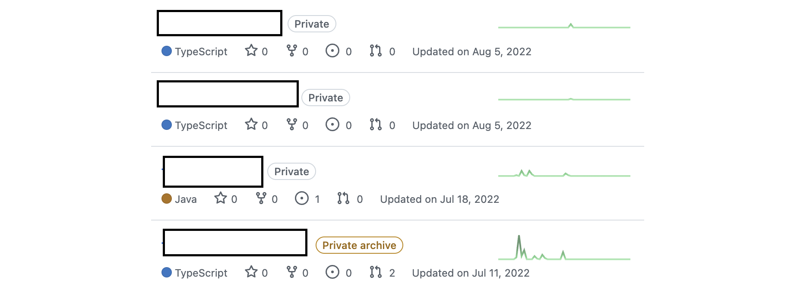
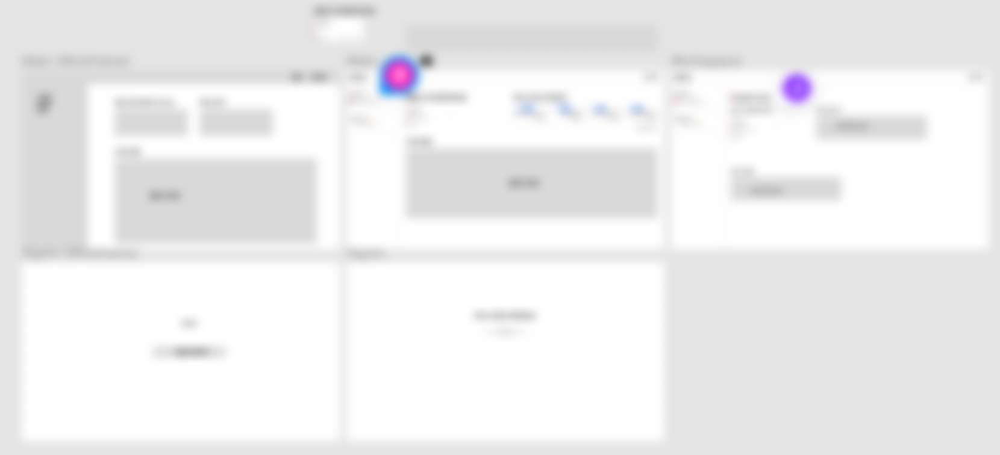

2023년이 되었고 2022년 회고를 써보려고 한다.

2019년부터 회고를 꾸준히 써오고 있는데 뭘 써야할지 모르겠다는 생각이 들었던 적은 이번이 처음인 것 같다.

그래도 가장 기억에 남거나 아쉬웠던 점들을 정리해보았다.

## 첫번째 회사에서의 1년

다음주면 인턴을 제외한 정규직으로 첫번째 회사에서의 1주년이다.

입사 후 한달은 온보딩 과정을 밟았다. 그리고 Santa (AI Tutor) 팀에 조인하게 됐다.

### 첫번째 팀

Santa팀은 꽤 신기한 기술을 사용한다.

서버 - 클라이언트 통신 시 `gRPC`라는 기술을 사용하는데 `gRPC`는 들어만 봤고 실제로 사용해보지 않아서 처음에는 좀 어려웠다. `json`이 아닌 `proto`를 이용하는 등 나에겐 꽤 생소했었다.

하지만 이렇게 `proto` 파일을 사용해 `Schema First` 로 개발하니 서버 개발자와 클라이언트 개발자의 불필요한 커뮤니케이션 비용이 발생하지 않아서 좋은 것 같다. (다만 아직 클라이언트에서 gRPC기술은 성숙하지 않은 것 같다)

또 Santa팀은 PM, 디자이너, 개발자까지 모두 20명이 넘는 꽤 큰 조직이었다. 그래서 항상 개발 방법론이나 팀 운영에 관해서 많은 논의가 있었고 관련해서 많이 배웠던 것 같다.

### 다양한 경험

실제로 고객이 비용을 지불하는 서비스를 개발하다보니 다양한 경험들을 할 수 있었다.

다국어 지원, 다양한 환경에서 발생하는 오류 리포팅, 서비스 운영을 위한 브랜치 전략, 웹뷰 환경 개발 등 새롭게 경험해볼 수 있는 것들이 너무 많았다.

실제 서비스를 통해서만 경험해볼 수 있는 결제와 관련된 작업도 해볼 수 있어서 좋았다.

이렇게 기술적으로 다양한 경험을 할 수 있었지만 힘들었던 적도 있었다.

올해 중순 스타트업 투자 시장이 좋지 못했고 많은 스타트업이 인원을 감축했다. 우리 회사도 예외는 아니었고 많은 사람이 떠나게 되었다.

회사 분위기도 어수선했고 같이 일했던 사람들이 떠나니 마음이 좋지 않았다.

### 산업기능요원

2022년 12월 말 산업기능요원 TO를 받았고 지금은 서류를 준비하고 편입을 앞두고 있다.

올해부터는 군인 신분으로 회사를 다닐 것 같다. 병역 문제는 고등학생때부터 고민하고 있던 문제였는데 편입할 수 있어서 마음을 놓을 수 있었다.

## 개인적인 이야기

회사에 대한 회고는 이쯤하고 개인적으로 했던 일들에 대한 회고를 해보려고 한다.

### 사이드 프로젝트

두번의 사이드 프로젝트를 했지만 모두 실패했다.

첫번째 사이드 프로젝트는 마이스터고등학교의 졸&재학생 커뮤니티였다.

2022년 8월을 마지막으로 프로젝트가 더 진행되지 못했다. 문제는 두가지였던 것 같다.

- MVP를 설정하지 못해서 많은 팀원을 모집한 것
- 오너쉽이 부족했던 것

MVP를 설정하지 못했다. 처음 기획에서 점점 살이 붙어서 너무 커져버렸고 팀원을 너무 많이 모집해버렸다. 그러다보니 아무도 프로젝트에 오너쉽을 가지지 못했다.

두번째 사이드 프로젝트는 사이드 프로젝트 관리 서비스였다.

첫번째 프로젝트를 교훈삼아 3명으로 진행했었고 와이어 프레임, 디자인 작업, 코드 작업도 어느정도 하는 중 각자가 바빠져서 못하게되었다.

둘다 팀원이 모두 아는사람이라 편해서 더 열심히 하지 못했던 것 같다.

사실 내가 열심히 하면 어찌되었든 마무리 할 수 있을 것 같았다라는 생각이 들어서 아쉽고 2023년은 더 나은 사이드 프로젝트 경험을 하고 싶다.

### 운동

운동은 몇가지를 해봤다.

- 헬스
- 러닝
- 수영
- 풋살

풋살은 2~3주에 한번은 한다. 꾸준히 하는 운동으로 헬스, 러닝, 수영을 해봤는데 사실 수영이 제일 재밌다. 다만 수영은 진도가 있어서 부담도 됐고 새벽 수영을 하면 너무 피곤해서 그만두었다.

요즘은 다시 헬스를 하고 있는데 운동을 하지 않으니 몸이 뻐근하고 더 피곤한 것 같아서 다시 시작했다.

### 영어공부

영어 스터디를 친구와 시작했었다. 다양한 방법을 시도해보고 찾아가고 있는데 요즘은 미드 쉐도잉을 하고 있다.

예전보다는 자신감이 조금 생긴 것 같은데 실력은 아직 잘 모르겠다. 꾸준히 하는게 제일 중요할 것 같다.

### 이전 목표와 새로운 목표

#### 2022 목표

- **회사에 잘 적응하고 기여하기** 아직 배울건 많지만 잘적응해서 열심히 일하고 있다 ✅
- **새로운 기술 꾸준히 공부하기.** 예상과 달리 회사에서 더 많은 기술들을 접해볼 수 있었다. 내가 노력하지 않았지만 많은 기술을 접했다. ✅
- **사이드 프로젝트.** 진행은 했으니.. 다음엔 완료를 목표로.. ✅
- **건강 관리하기(헬스)** 꾸준히 못한게 아쉽다. 내년엔 조금더 꾸준히 해야겠다.
- **기술 블로그 자주 쓰기** 작년에 한달에 한두번이 목표였는데 작년 회고 이후로 총 19편을 썼다. 그래도 12편은 넘었으니 완료 도장을 줘야겠다. ✅

#### 2023 목표

- **사이드 프로젝트 서비스하기** 올해엔 작년을 교훈삼아 꼭 서비스되는 사이드프로젝트를 하고 싶다.
- **꾸준히 운동하기** 헬스나 수영 등 어떤 종목이든 꾸준히 운동을 해야될 것 같다.
- **꾸준히 기술 블로그 쓰기** 배운 내용을 블로그에 정리하는 습관을 들여야할 것 같다. 작년보다 조금 더 꾸준히 자주 쓰면 좋을 것 같다.
- **영어 공부 하기** 요즘 영어를 잘하고 싶다는 욕심이 생겨서 더 열심히 공부해야겠다.

생각보다 지루한 글이 된 것 같다. 올해는 정말 정신없이 지나간 것 같은데 내년엔 더 많고 재밌는 일들이 있었으면 좋겠다.

Happy New Year
