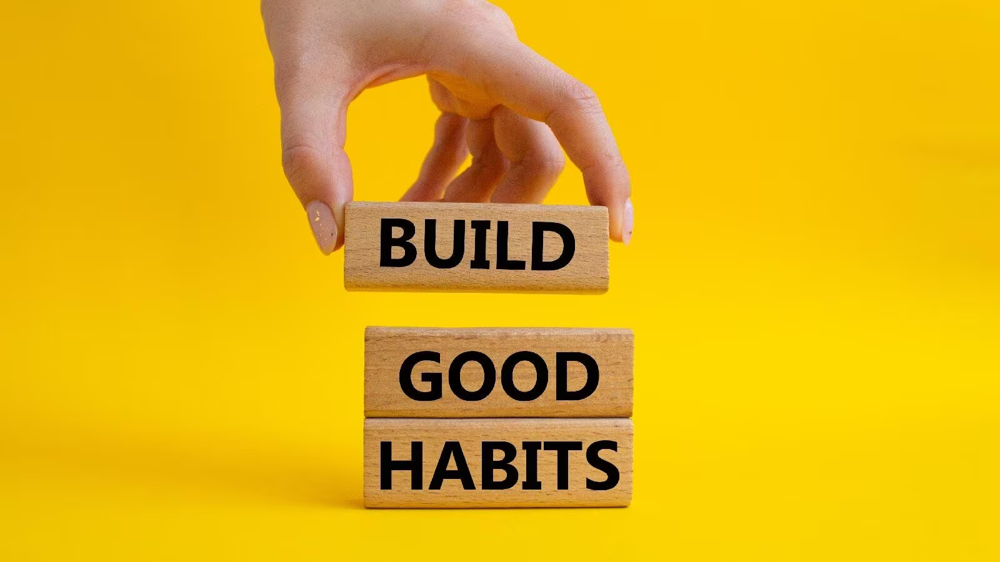
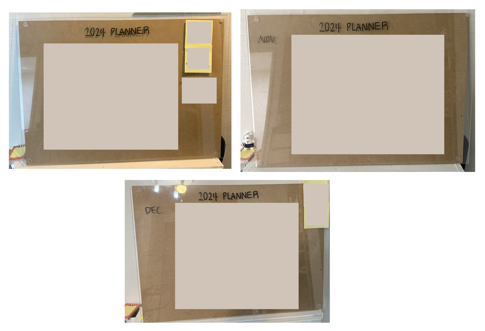
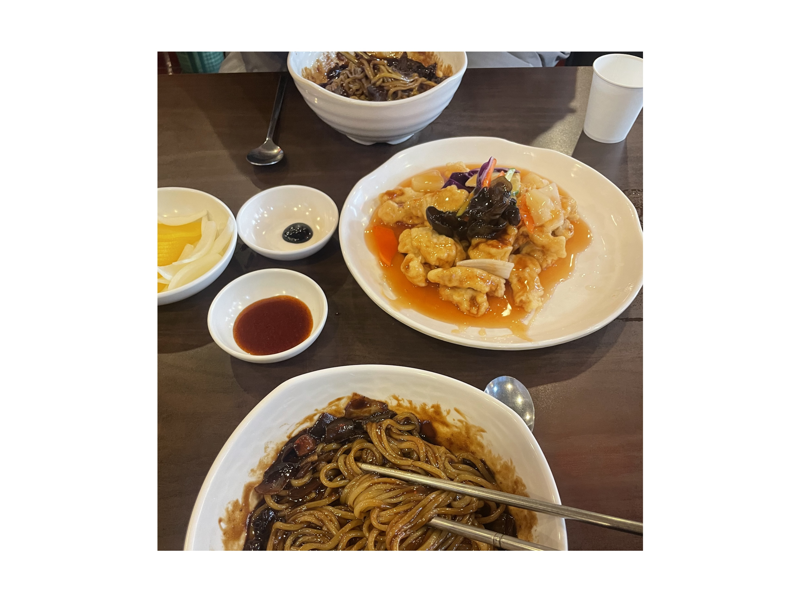
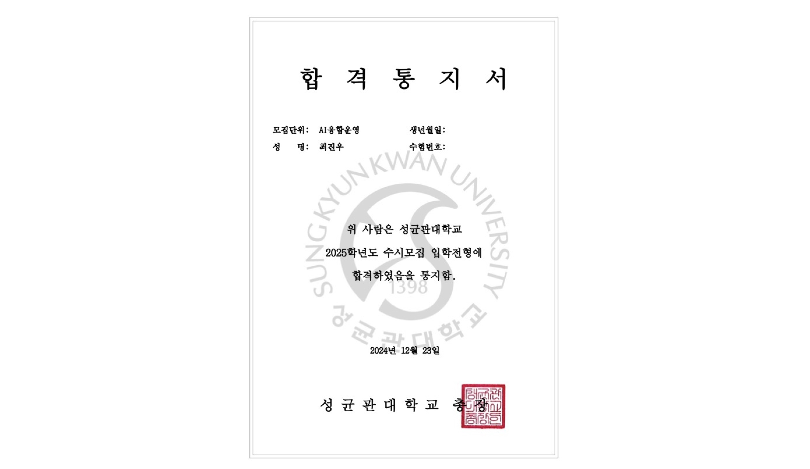
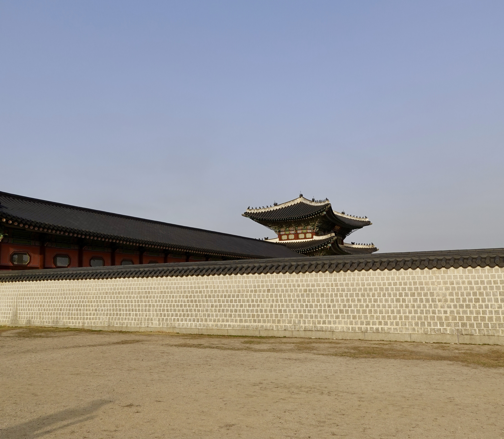
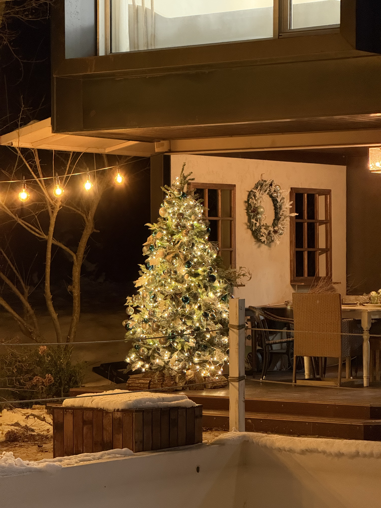

어김없이 연말이 찾아왔다. 올해는 연말에 조금 여유가 있어서 천천히 회고를 써보려고 한다.

올해 나에게 겉보기 큰 변화는 없었다. 작년에 토스로 이직한 후 여전히 같은 팀에서 일하고 있다.  
그렇지만 나에게 2024년 한해는 정말 많은 성장을 이뤘던 해였던 것 같다.

# 비즈니스와 개발자

올해 가장 많이 했던 고민이다.

**비즈니스 기여와 기술부채의 밸런스를 어떻게 맞출 수 있을까?**

제한된 리소스로 팀의 수많은 백로그를 처리하기 위해선 우선순위 설정도 중요하지만 어느 정도
기술부채가 필요하다고 생각했다. (물론 아직 이 생각은 유효하다)

전 회사와 달리 하나의 팀에 프론트엔드 개발자가 1명 혹은 2명이고 다양한 제품의 실험이 병행되는 환경에서
결국 나에게 결정할 책임과 권한이 생긴다.

_'얼마나 빚을 내서 일정을 맞출까?'_

그럼 바쁘단 핑계로 점점 관대해졌던 것 같다.

결국 이게 부정적인 결과를 만들 것이라는 것을 알아도 하게되는 것 같다.
정말 오랫동안 고민했지만 기술부채를 `얼마나 감당해야 할지는`는 여전히 잘 모르겠다.

현재까지 나름의 고민의 결론은 이렇다.

**'잘 기록하고 개선하자'**

기술부채를 갚는 작업을 백로그로 관리하고 개선하는 것이다.

요즘 틈틈이 배포 후 급한일이 없다면 코드 개선을 하고 있다.  
개선의 방향은 정말 다양하다. 새로운 아케텍쳐 적용, 테스트 코드 작성, 중복 코드 제거 등등..

# 습관의 중요성

2024년 한해동안 좋은 습관을 만드려고 노력했던 것 같다.

주로 아침 시간, 출근 시간을 이용해서 습관을 만들려고했다.

아침에 영어 듣기를 하거나 출근시간에 책을 읽는 습관을 어느 정도 만든 것 같다.

사실 매일매일 같은 시간에 했던건 아니었다.  
완전히 루틴으로 만들지는 못했지만 어느 정도 '영어 공부하는 습관'을 만들어서 꾸준히 공부를 지속하는 데 큰 도움이 됐다.

# 목표를 달성하기 위한 노력

[2023년 회고](https://choi-jinwoo.github.io/post/etc/2023-retrospection/)를 작성하며 느꼈던 짧은 단위로 목표를 설정하고 달성하기를 실천하기 위해서
매달의 목표를 만들고 눈에 보이도록 플래너를 만들었다.

사실 2024년은 유독 바쁜 기간이 있었는데 그때마다 조금씩 조절하면서 목표를 세울 수 있어서 좋았고 항상 목표했던 일들이 눈에 보이니
동기부여가 되었던 것 같다.

# 결국은 선택과 집중 (One thing)

2024년 다양한 것들을 새롭게 배우려 했다. 꾸준히 해오던 영어공부, 기타 레슨, 개발공부, 운동에 더해 일본어, 수학, 데이터 등등 관심사가 많아져
다양한것들을 조금씩 해봤던 것 같다.

물론 모두 배우면서 재밌었던 것 같다. 하지만 결국 시간과 의지는 한정적이고 한두개에 집중하면 나머지엔 소홀해지기 마련인 것 같다.

그래서 각 영역(공부, 건강, 취미 등)에 대해서 몇가지에만 선택과 집중을 해서 하려고 한다.
사실 인내심이 부족해서 하나를 꾸준히 하는 걸 못해서 오히려 여러가지를 배웠던 것 같다.

---

# 개인적인 내용들

2024년 한해동안 배우고 느꼈던 것들을 먼저 정리해봤다.

이제는 지극히 개인적인 내용들을 정리해보겠다.

## 이사

원래 살던 곳의 계약기간이 끝나서 3월에 이사를 했다. 최대한 원래 살던 동네에서 살고 싶어서 근처로 알아봤었다.

원래 살던 곳 보다 회사에서 조금 멀어졌고, 교통도 조금 안좋아졌는데 나머지는 마음에 들어서 계약을 하게 됐다.

원래 예정된 일이었지만 처음 서울에 올라온 후 첫 이사라서 많이 신경쓰였는데 잘 마무리한 것 같다.

## 대학교 진학

마이스터고를 졸업하고 바로 취업을 해서 빠른 경제생활을 하다보니 좋은 점도 정말 많지만 아쉬운 점들도 있던 것 같다.

내가 느낀 아쉬운 점들은 '학위', '공부', '환경' 정도인 것 같다.

1. 학위: 사실 살면서 당장 학위가 필요한적은 없었다. 하지만 언젠가 내가 학위가 필요한 시기가 오지 않을까 라는 생각을 많이 했던 것 같다.
2. 공부: 고등학교 졸업 이후로는 무언가를 배울때 직접 능동적으로 공부를 해야하고 그렇게 해왔다. 하지만 새로운 것을 처음 배울때 혼자 공부하는건 쉽지 않은 것 같았다. 그래서 대학에서 배우고 싶었다.
3. 환경: 가장 큰 요소였던 것 같다. 물론 주변에 보고 배울 수 있는 사람들이 많지만 대부분 비슷한 일을 하는 사람들이 많다. 다 다양한 사람들을 만나고 배우고 싶었다.

그래서 다양하게 알아봤는데 재직자특별전형으로 진학하는게 제일 합리적인 것 같았다.  
7월 즈음 부터 준비해서 총 6군데 원서를 넣었고 3곳에 합격했었다.

그래서 내년부터는 직장인이자 학생인 신분으로 회사와 학교를 병행하게 됐다.

> **라섹**  
> 평소 운동과 액티비티를 좋아해서 자주 다니다보면 항상 안경이 불편했다.  
> 그래서 10월 즈음 라섹을 하고 편해진 점이 엄청 많은 것 같다. 사실 수술 후 일주일은 너무 아파서 조금 후회했었다.

> **여행**  
> 올해도 여행을 많이 다녀왔는데 제주도, 삿포로를 다녀왔고 팀원들과 푸켓, 혼자 마쓰야마를 다녀왔다.

> **책**  
> 한해동안 다양한 장르의 책을 읽었다. 경영, 경제, 심리, 소설, 회계 등 다양한 책을 읽었다.  
> 예전에는 개발 관련 책을 위주로 읽었는데 요즘엔 더 다양한 책을 읽으려고 하는 것 같다.
> (오히려 개발 관련에서 벗어나 다른 분야의 책을 읽는게 좋았던 것 같다.)

# 2025년은

2025년은 정말 바쁜 한해가 될 것 같다.

내년의 가장 큰 목표는 회사와 학교를 병행하는 방법을 찾는 것이다.  
직장인, 학생 두 신분 중 어느 한쪽이 소홀해지지 않도록 적절한 균형을 맞추는 것이 내 목표이다.

그리고 내년엔 다양한 것 보다는 `영어, 수학, 운동(복싱)` 이 3가지에 조금 더 집중해보려고 한다.

회고엔 표현되지 않았을 수 있지만 2024년은 정말 정신없는 한해였던 것 같다.  
개인적으로도 이사나 대학교 진학과 같은 일들이 있었고 회사에서도 주택담보대출/전세대출 대환대출 플랫폼 오픈 등 밤을 꼬박 새야할 정도로 바쁜 일들이 많았다.

정신없는 2024년 회고를 한해 사진들로 마무리한다.

