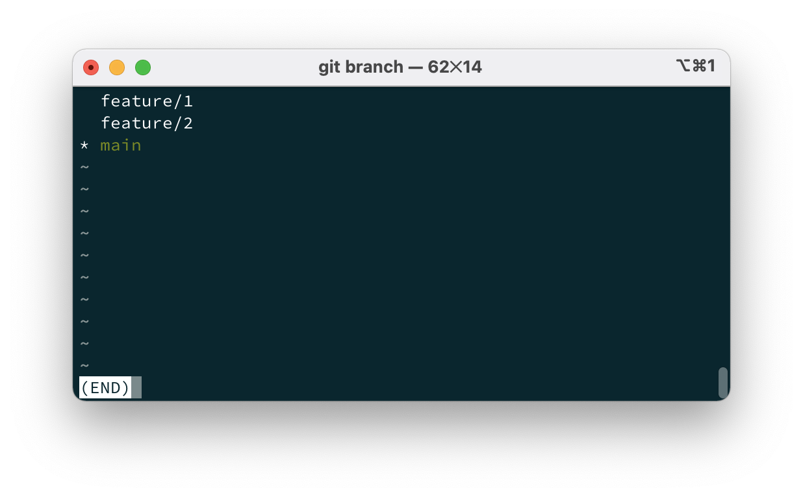

Git을 사용하다 보면 병합된 후 더이상 사용하지 않는 branch가 많아진다.

이렇게 사용하지 않는 브랜치들이 많아진다면 `git` 명령어 사용 시 헷갈리거나 자동완성이 제대로 안되는 경우가 많다.

그래서 난 사용하지 않는 브랜치는 한번씩 정리해주는데 그 방법을 글로 정리해보려고 한다.



`git branch` 명령어를 수행했을때 결과이다. `main`은 계속 사용하지만 `feature/1`과 `feature/2`는 사용하지 않는 브랜치이다.

각각을 삭제하는 방법은 간단한 `git` 명령어를 통해할 수 있다.

```shell
$ git barnch -D feature/1
```

다만, 한번에 모든 브랜치를 삭제하려면 다른 방법을 사용해야한다.

```shell
$ git branch | grep -v "main" | xargs git branch -D
```

간단한 설명을 덫붙이면 `git branch`의 결과값 중 `main`을 제외한 값을 합쳐 `git branch -D`로 넘긴다.

`grep`은 패턴이 일치하는값을 가져오며 `-v`를 사용해서 패턴에 일치하지 않는 값을 가져올 수 있다. `xargs`는 인자로 넘어온 값을 하나로 만든다.

```shell
echo "Hello\nWorld\nHello" | grep "Hello" | xargs # Hello Hello
```

위 명령어는 `Hello\nWorld\nHello`에서 `Hello`라는 값을 가지는 라인을 가져오며 `xargs`로 다시 한라인으로 만든다.

`Unix` 명령어를 이용해서 브랜치를 한번에 삭제하는 방법을 정리해봤다.
