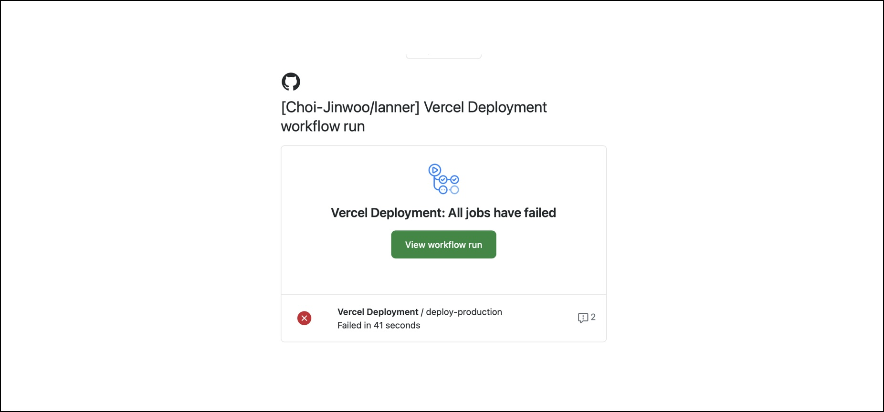

회사와 Github 계정을 분리해서 사용하는 사람도 많지만 개인 계정으로 회사 저장소에 기여하는 사람도 많을 것 같다.

나도 이전 회사에서 개인 계정으로 함께 사용했는데 이때 불편했던 경험 중 하나는 회사 organization, repository에서 발생하는 Github notification들이 개인 이메일로 온다는 점이었다.

제일 많이 왔던건 `코드 리뷰`, `PR status update`, `Github Actions Job failed` 알림이었다. 이렇게 메일이 쌓이다 보니 메일함 정리가 잘 안됐다. (차라리 스팸메일이었다면 차단했을 것 같은데)

개인 메일함을 정리하고 싶어서 방법을 찾아보다 Github의 이메일 라우팅 기능을 발견했다

이 기능은 조건을 설정해 조건에 맞는 Github 알림을 특정 이메일로 라우팅 해주는 기능이다.

먼저 Github엔 여러 이메일을 등록할 수 있다.

# Github 알림 라우팅

## 1. 이메일 등록

[https://github.com/settings/emails](https://github.com/settings/emails)로 접속해 `Add email address`로 회사 이메일을 등록해주었다.

(물론 회사 이메일이 아닌 다른 이메일도 가능하다)

## 2. Notification 라우팅

[https://github.com/settings/notifications](https://github.com/settings/notifications)에서 `Custom routing` 버튼을 통해 설정할 수 있다.

`Notifications 탭` > `Custom routing` > `Add new route` > `설정하고 싶은 organiztion / 라우팅할 이메일 선택`

사실 이렇게만 해주면 끝이다. 엄청 간단하지만 꽤 유용했던 기능이라 글로 남겨두면 좋을 것 같아서 정리해봤다.
