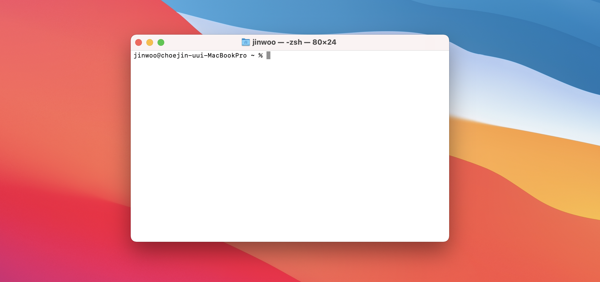
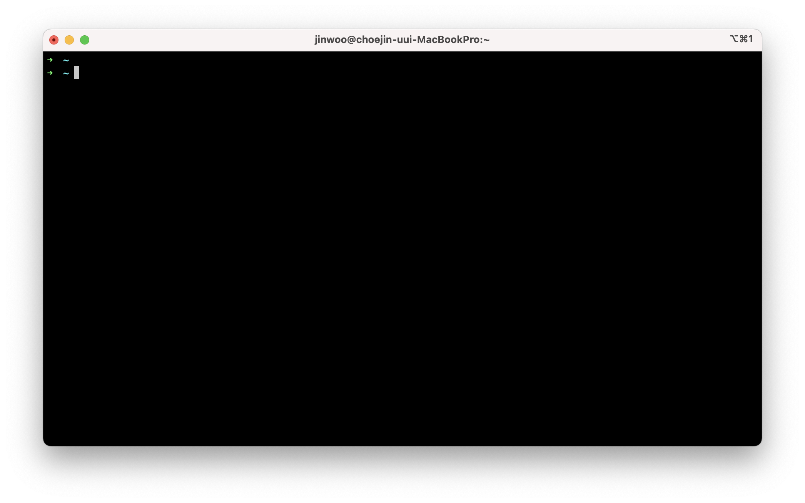
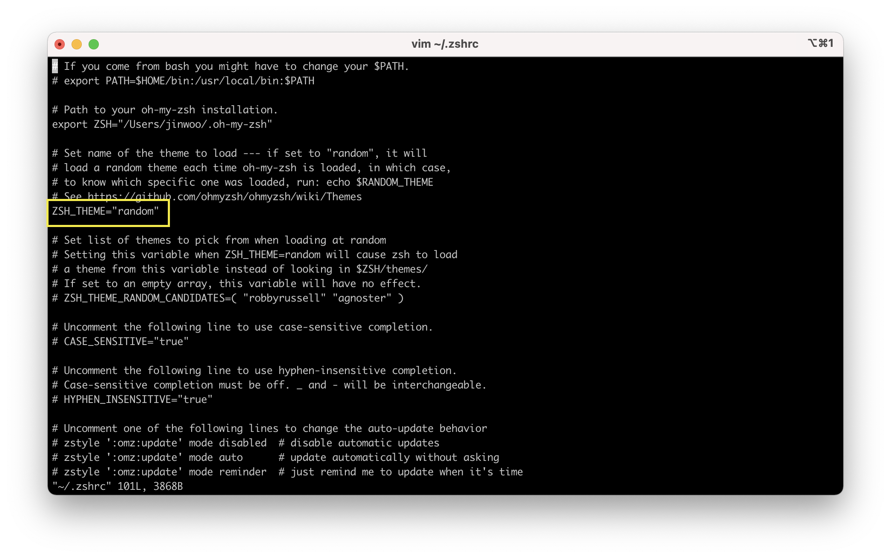
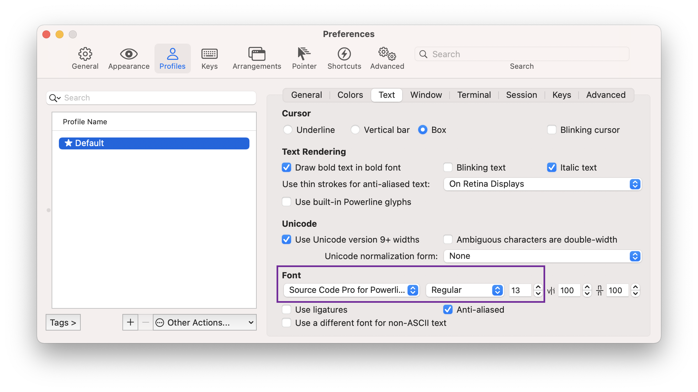
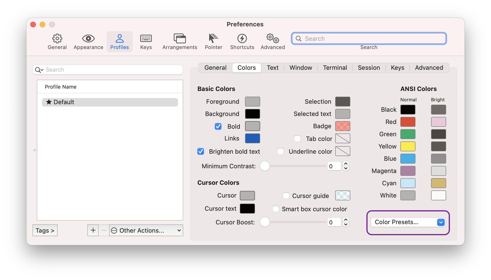
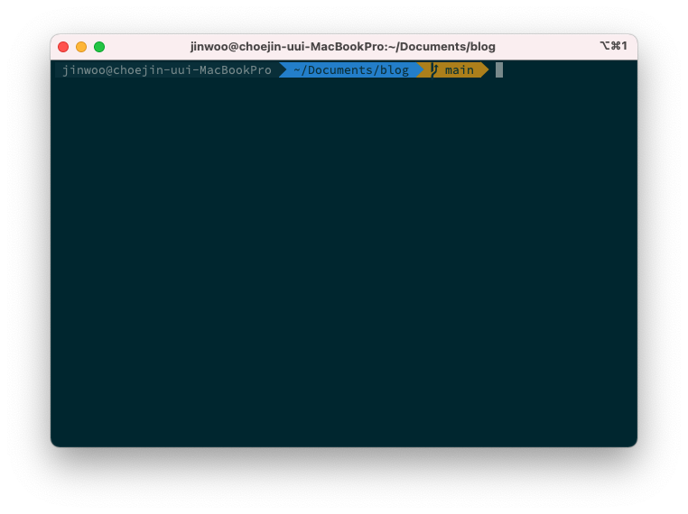
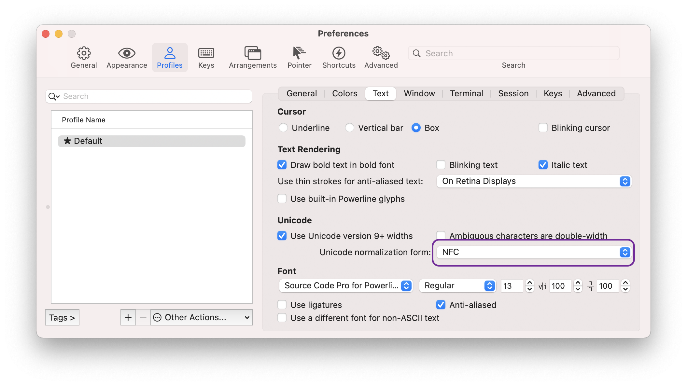
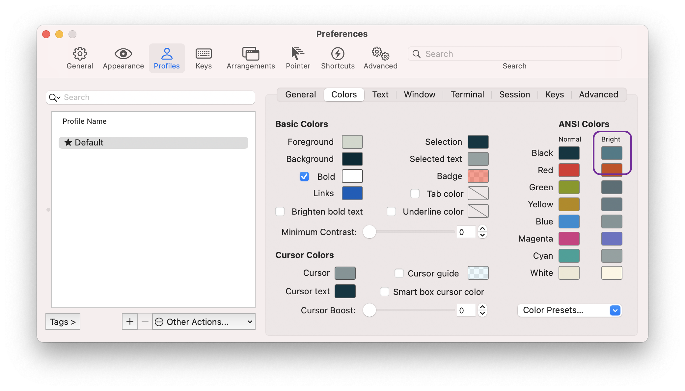

개인적으로 macOS 쓰면서 `unix` 기반의 터미널이 마음에 들었다.

하지만, 기본 터미널은 너무 못생겼다.



그래서 항상 따로 설정해 사용했는데 매번 찾아보기도 번거롭고 정리해두면 좋을 것 같았다.

#### iTerm2 설치

`iTerm2`는 MacOS의 기본 터미널을 대신해 사용할 수 있는 터미널 애플리케이션이다.  
기본 터미널보다 다양한 기능을 제공한다.

[iterm2.com](https://iterm2.com)에서 `Download`버튼을 통해 설치한다.

#### Homebrew 설치

[Homebrew](https://brew.sh/index_ko)는 macOS 패키지 관리자이다. `brew` 명령어를 통해 쉽게 패키지를 관리할 수 있다.

```
/bin/bash -c "$(curl -fsSL https://raw.githubusercontent.com/Homebrew/install/HEAD/install.sh)"
```

위 명령을 통해 설치한다.

#### ZSH 설치

`ZSH`은 `Bourne Shell`의 확장 버전으로 여러 플러그인과 테마를 지원한다.

brew를 통해 설치한다. (카탈리나부터 기본 ZSH 설정이라고 한다)

```
brew install zsh
```

#### Oh my ZSH 설치

Oh my ZSH를 통해 여러 테마와 플러그인을 사용할 수 있다.

```
sh -c "$(curl -fsSL https://raw.githubusercontent.com/ohmyzsh/ohmyzsh/master/tools/install.sh)"
```

위 명령을 통해 설치한다.

#### 테마 설정

현재 단계 까지 완료했다면 아래와 같은 모습이다.



아직 예쁘다고 할 수 없다. 테마를 설정해야한다.

```
vim ~/.zshrc
```

vim을 통해 `~/.zshrc`파일을 열어준다.



`ZSH_THEME` 부분을 바꿔주면 된다. 주로 `agnoster`를 많이 사용하는 것 같지만 난 `random` 테마를 사용한다.

말 그대로 터미널 실행마다 랜덤한 테마로 설정된다.

```
source ~/.zshrc
```

`source` 명령을 통해 변경을 적용한다.

#### 폰트 설정

테마 설정 후 폰트가 깨질 수 있는데 이때 폰트를 설정해줘야한다.

`command + ,`를 통해 설정 창을 열어준다. `profile > Text > Font`에서 설정할 수 있다.

난 `powerline`폰트 중 `Source Code Pro`를 사용했다.



#### 색상 테마 설정

테마를 설정하면 더 예쁘게 사용할 수 있다.

[iTerm2 Color 스키마](https://github.com/mbadolato/iTerm2-Color-Schemes)에 다양한 색상 테마가 있다.

해당 저장소를 `clone` 받은 후 `/schemes/*.itermcolors`를 불러올 수 있다.



`Color Presets...`를 클릭한 후 `import`를 통해 다운받은 `itermcolors` 파일을 불러오고 설정할 수 있다.

`Solarized Dark`라는 기본 스키마를 사용했다.

스카마 적용 후 `Foreground`를 흰색으로, `Brighten bold text` 옵션을 비활성화 했다.



#### 사용자 이름 삭제

`jinwoo@choejin-uui-MacbookPro`라는 부분은 필요없고 보기도 불편하다.

```
vim ~/.zshrc
```

마찬가지로 `.zshrc`파일을 열어주고 파일의 가장 하단에 아래 내용을 추가한다.

```
prompt_context() { }
```

#### 한글 자소 분리

iTerm을 사용하면 한글이 제대로 표시되지 않는다.



`Preferences(설정) > Profiles > Text > Unicode normalization form`을 `NFC, HFS+` 중 하나로 설정하면 해결할 수 있다.

#### 플러그인

**Syntax Highlight**

문법 강조를 위한 플러그인이다.

```
# 플러그인 설치
brew install zsh-syntax-highlighting

# .zshrc 파일에 접근
vim ~/.zshrc

# 파일 하단에 아래 내용 추가
source /usr/local/share/zsh-syntax-highlighting/zsh-syntax-highlighting.zsh
```

**Auto Jump**

이전에 이동한 디렉터리로 한번에 이동할 수 있는 플러그인이다.

```
# 플러그인 설치
brew install autojump

# .zshrc 파일에 접근
vim ~/.zshrc

# 파일 하단에 아래 내용 추가
source /usr/local/share/autojump/autojump.zsh
```

**Auto suggestions**

이전에 작성한 구문을 추천해주는 플러그인이다.

```
# 플러그인 설치
brew install zsh-autosuggestions

# .zshrc 파일에 접근
vim ~/.zshrc

# 파일 하단에 아래 내용 추가
source /usr/local/share/zsh-autosuggestions/zsh-autosuggestions.zsh
```



`zsh-autosuggestions` 플러그인을 사용하기 위해선 `Preferences > Profiles > Colors > ANSI Colors > Bright`의 첫번째 색상을 바꿔 줘야한다.

해당 색상으로 추천이 표시된다.
