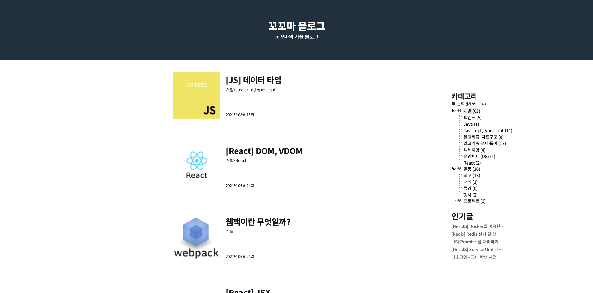

블로그의 첫 글로 블로그에 대해 소개하고 앞으로의 다짐을 적어보려 한다.

여러 플랫폼을 사용해보고 느낀점도 있으니 참고해도 좋을 것 같다.

## 드디어 정착.

나는 블로그 유목민이다. 이제껏 사용해본 플랫폼이 꽤 많은데 각각의 경험의 한줄 코멘트로 정리해봤다.

- **네이버 블로그**  
  서로이웃 기능이 활발하지만 구글 검색에 상단 노출이 적었기에 기술 블로그로 아쉬움이 있었음

- **velog**  
  구글 상단 노출도 잘되서 기술 블로그로 쓰기 좋았지만 내부 플랫폼의 트렌딩을 통한 유입이 많았기에 아쉬웠음

- **자체 제작 플랫폼**  
  Express, Vue를 통해 직접 플랫폼을 개발해 운영했고 커스텀도 쉬웠지만 상단 노출이 잘 안됐고 운영에 비용이 발생해 지속하기 힘들었음

- **tistory**  
  구글 상단 노출도 잘됐고 조회수도 꽤 나왔지만 커스텀이 꽤 쉽지 않았고 글 작성하기도 불편한 점이 있었음

최근까지 사용하던 [tistory 블로그](https://wlswoo.tistory.com)의 스킨이 마음에 안들었고 외에도 다양한 불편함이 있었어 옮기기로 결정했다. 꽤 쌓인 글이 있어 옮기기 고민이 됐었고 아직도 어찌할 지 모르겠다.

## 쉽다..

`Gatsby + typescript`를 사용해 개발했는데 React기반이라 꽤 쉽다. [Gatsby 공식문서](https://www.gatsbyjs.com/)의 튜토리얼만 따라해도 어느정도 만들 수 있을 정도였다.

3일 정도 따라하면서 만들 수 있었다. 쉽기도 쉬웠고 플러그인이 해주는게 많아 직접 개발할 내용은 많지 않았다.

Gatsby에 대해서 아직 깊게 공부해보지 못해 다음에 기회되면 다시 문서를 보며 정리해봐야겠다

## 예전 글

사실 `tistory`에서 벗어나야겠다는 생각은 꽤 오래전부터 했지만 못했고 그 이유는 위에도 언급했지만 이제껏 작성한 글이 꽤 있기 때문이다.

같은 내용의 글이 여기저기 있는 것도 애매하고 모두 옮기기도 힘들 것 같아 아직도 고민이다.

엄청 많은 수준은 아니지만 다 자식같은 글이고 다 옮기고 싶다.

일단 단순 코딩테스트를 준비한 글보단 회고글이나 열심히 쓴 글 위주로 중간 중간중간 옮겨볼 생각이다.  
(예전 tistory 글이 궁금하다면 [링크](https://wlswoo.tistory.com)을 참고)

## 앞으로

요즘 바쁘다는 핑계로 블로그 글을 못쓴지 좀 오래 됐는데 다시 좀 써보려고 한다.

글도 조금 더 **깔끔하고 읽기 좋게** 써보려고 한다. 평소에 단순 기록 용도로만 글을 쓰다보니 잘 읽히지 않는데 조금 더 신경을 써야할 부분이라고 생각해 개선해야겠다.

블로그도 빨리 글을 쓰고 싶어 서둘러 개발했는데 아직 완성 못한 기능도 차근차근 추가해볼 생각이다.
