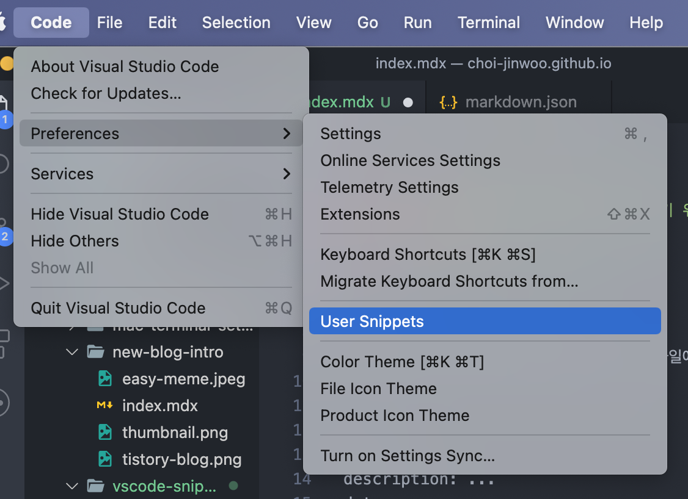
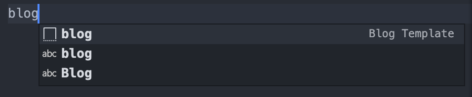
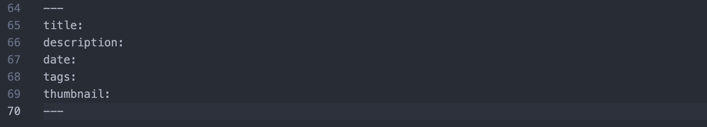

평소에 블로그 글을 작성하기 위해선 `mdx` 파일에 같은 format으로 제목, 설명을 작성해줘야한다.

```
---
title: ...
description: ...
date: ...
tags: ...
thumbnail: ...
---
```

항상 다른 글에서 가져와도 생각보다 귀찮은데 이걸 `VSCode Snippets` 기능으로 쉽게 사용할 수 있다.



`Code → Preferences → User Snippets`를 클릭한다.

특정 언어나 파일에서 작동하는데 `언어.json` 의 형식으로 파일이 만들어진다.

난 `mdx` 파일에서 snippets을 사용해서 `mdx.json`으로 만들어졌다.

```
{
  "Blog Template": {
    "prefix": "blog",
    "body": [
      "---",
      "title: ",
      "description: ",
      "date: ",
      "tags: ",
      "thumbnail: ",
      "---"
    ],
    "description": "블로그 글 템플릿"
  }
}

```

- `prefix`는 Snippet을 활성화할 단어다.
- `body`는 배열로 값이 들어갈 수 있으며 각 요소는 한줄로 표현된다. Snippet의 결과물이다.
- `description`은 Snippet에 대한 설명을 작성하면 된다.

파일을 저장하고 조금 기다리면 적용이 완료된다.



이렇게 vscode에서 prefix를 입력하면 snippet을 사용할지 선택할 수 있고 선택하면 아래처럼 body가 출력된다



Snippet을 사용해서 반복해서 사용되는 코드를 복붙없이 쉽게 사용할 수 있다.
