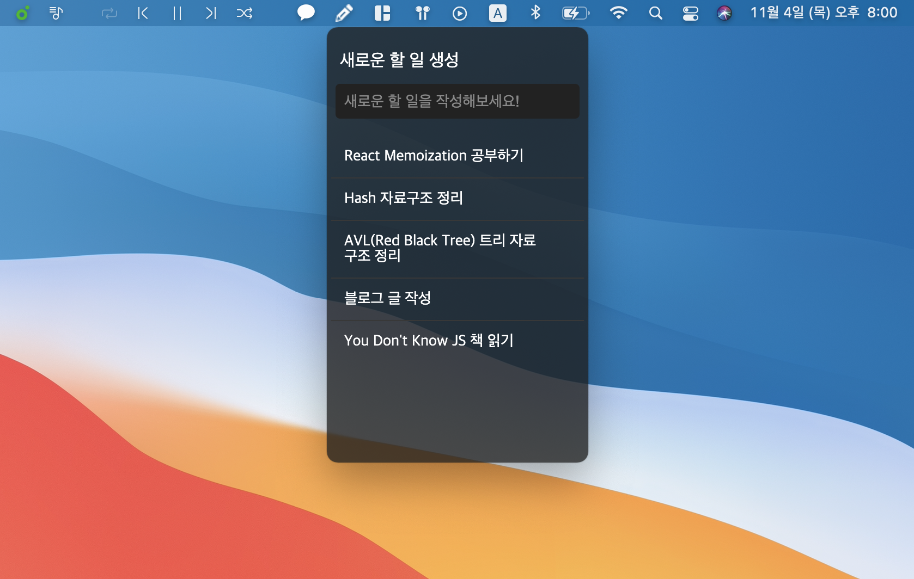
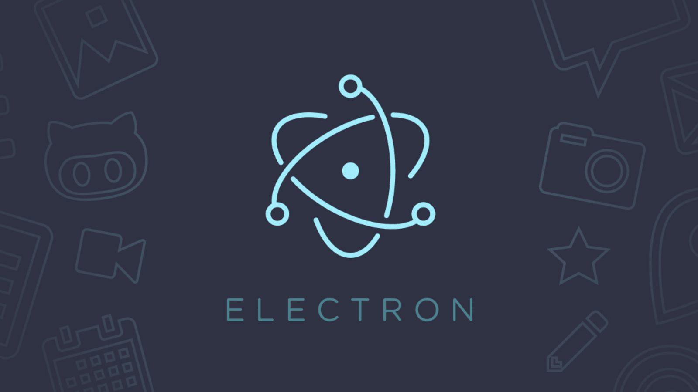

할 일 관리는 보통 튜토리얼 중 만들어 보는 기능이다.

이번 글은 실제 필요에 의해 할 일 관리 앱을 만들어 사용하게된 과정이다.

[설치 & Github 저장소](https://github.com/choi-Jinwoo/soft-todoA)

## Motive

평소 할 일 관리 앱을 많이 사용한다. 미리미리 할 일들을 정리해두지 않으면 까먹거나 급하게 해야된다.

나는 주로 `Microsoft Todo`를 썼다. 기능은 충분지만 손이 잘 안갔다. **고작 할 일을 보기 위해 앱을 찾고 앱을 키는게 너무 귀찮았다.**

그래서 기능을 줄이고 편하게 쓸 수 있는 할 일 관리 앱을 만들기로 했다.

## Concept

목표는 분명했다. **필수 기능을 편하게**쓰고 싶었다.

먼저 앱을 따로 키거나 찾지 않아도 사용할 수 있도록 **메뉴바에서 접근**할 수 있도록 했다.

기능은 아래 두가지 기능을 지원하며 점차 추가하기로 했다.

- 할 일 추가
- 할 일 완료

## POC

간단한 프로토타이핑으로 가능한지 증명해야했다.

`Swift`를 통해 앱을 개발했다면 `widget`과 같은 컨셉도 생각해볼 수 있겠지만 나는 **Swift를 못한다.**

빨리 만들어 쓰고 싶었기 때문에 익숙한 기술을 사용하기로 했다.

Javascript 기반의 데스크톱 앱 프레임워크 [Electron](https://www.electronjs.org/)으로 만들기로 결정했다.

`Electron`으로 간단한 데스크톱 앱은 개발할 수 있었고 [menubar](https://www.npmjs.com/package/menubar)라는 패키지를 통해 메뉴바에서 조작도 가능했다.

## Develop

간단한 앱인 만큼 구현에 시간이 오래 걸리지 않았다. POC와 달리 `React + Electron + Typescript`를 통해 구현했다.

또한 [menubar](https://www.npmjs.com/package/menubar)라는 패키지를 사용하지 않고 내부를 참고해 직접 구현했다.

아직 관리되는 패키지였지만 `Downloads`가 꾸준한 관리를 믿고 쓸 수 있을 정도는 아니었다.

## Deploy

간단히 [Github의 Release](https://github.com/Choi-Jinwoo/soft-todo/releases)를 통해 `dmg, zip`을 배포했다.

물론 내가 쓰려고 만들었지만 다른 사람도 많이 써준다면 많은 동기부여가 된다.

(자동 업데이트 기능은 아직 구현하지 못했다)

## Conclusion

간단한 할 일 관리 앱이지만 사용자의 니즈를 파악하고 해결한다면 좋은 서비스라고 생각한다.

물론 내 요구사항에 맞춘 앱이지만 내가 느낀 불편함에 공감하는 사람이 있다면 써보면 좋을 것 같다.
